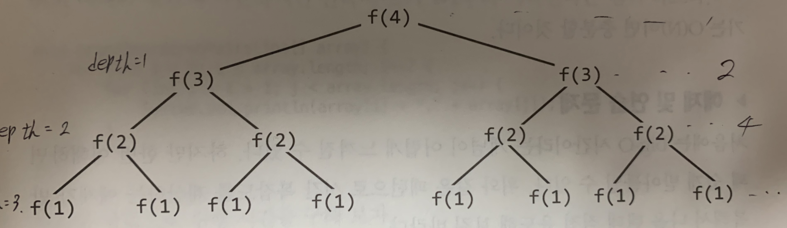

# **Big-O**
Big-O 시간은 알고리즘의 효율성을 나타내는 지표 혹은 언어이다.


### **Time Complexity (시간 복잡도)**
> **1.정의 : 알고리즘을 실행하여 종료할때 까지 필요한 시간**  

> 2.특징 : 점근적 실행 시간(Asymptotic runtime) 또는 big-O 시간에 대한 개념이다.  

> 3.표현 방식 으론 O(logN), O(NlogN), O(N), O(N^2), O(2^n), O(A*B) 등등.  


### **Big-O, Big-Θ, Big-Ω**  
> **1.Big-O : 최악의 경우가 나올때를 기준으로 표현하며, 가장 보편적으로 사용한다. ** 

> 2.Big-Ω : big-O와 반대되는 개념이며, 최선의 경우가 나올때를 기준으로 표현한다..  

> 3.Big-Θ : 위의 O + Ω 를 의미하며 최소와 최악의 중간인 평균적인 복잡도를 표현함..  


### **알고리즘의 경우의 수**  
> 1.최선의 경우 : 가장 빠르게 나오는 경우. 빈도수가 굉장히 적으며, 특수한 값을 넣어서 딱 맞아 떨어지는 경우를 의미한다.   

> 2.최악의 경우 : 모든 경우의수를 거치는 경우. 빈도수가 굉장히 적다.  

> 3.평균적인 경우 : 위의 두가지 경우는 자주 일어나지 않으므로, 평균적으로 표현할때 사용한다.  

> 최선의 경우에 시간 복잡도는 쓸만한 개념이 아니다. 많은 알고리즘은 최악의 경우와 평균적인 경우가 같다.


### **Space Complexity(공간 복잡도)**  
> **1.정의 : 알고리즘을 실행하여 종료할때 까지 기억장치(메모리)의 크기**    

> 2.공간 복잡도에 해당되는 경우 
>   -배열을 만드는 경우 : 1차원 배열(O(n)) , 2차원 배열(O(n^2)) 

> 3.계산되지 않는 경우.  
>  - 밑의 코드는 n번 호출 하지만, 위의 재귀 호출 처럼 스택에 동시에 존재하지 않으므로 공간 복잡도에 계산되지 않는다.
```java  
int pairSumSequence(int t) {  
      for(int i=0;i<n;i++){  
        sum+= pairSum(i,i + 1);  
        }  
        return sum;     
    }  
      
    int pairSum(int a,int b){  
    return a + b;  
    }  
    
```


### **상수항은 무시**  

> 1.이유 : Big-O는 단순히 증가하는 비율을 나타내는 개념이므로, 특수한 입력에 한해 O(N)코드가 O(1) 코드보다 빠르게 동작하는 가능성이 있기 때문이다.  
>   - 예시 : O(2N) => O(N) , O(2n^9) => O(n^9)  

> 2.Big-O 표기법은 수행시간이 어떻게 변화 하는지 표현해주는 도구이므로, O(N)이 언제나 O(2N)보다 나은것은 아니다.  

> 3.위의 예시 코드  
>   -코드 1은 루프 안에 2개의 코드가 있고, 코드2는 한개가 있다. 실행되는 명령어 개수를 세어보기 위해 어셈블리 단계에서 고려해야 할 부분들이 많기 때문에, 이것들을 생각하는건 하지 않는다.  

>   코드1
```java  
int min = Integer.MAX_VALUE;
int max = Integer.MIN_VALUE;
for (int x : array) {
      if(x < min) min = x;
      if(x > max) max = x;
    }
    
```
>   코드2
```java  
int min = Integer.MAX_VALUE;
int max = Integer.MIN_VALUE;
for (int x: array){
      if(x < min) min = x;
  }
for (int x : array){
      if(x > max) max = x;
  }
    
```


### **지배적이지 않은 항은 무시한다.**  
> 1.O(N^2 + N) 같은 수식에서 두번쨰 N은 상수는 아니지만, 그렇다고 특별히 중요한 항도 아니기 때문에 무시한다. => **O(N^2)**  

> 2.무시하는 예  
>   -O(N^2+N) => O(N^2)  
>   -O(N+logN) => O(N)  
>   -O(5*2^n+1000N^100) => 2^n  

> 3. 무시할 수 없는 경우  
>   -O(B^2+A) 이런 경우는 항을 하나로 줋일 수 없다.  


### **여러 부분으로 이루어진 알고리즘 : 덧셈 vs 곱셈.** 
> 지배적이지 않은 항은 무시한다에서 3에서 언급한 조심해야할 부분이다. 밑의 코드들은 예시이다.

코드1
```java  
for ( int a : arrA) {
      print(a) ;
 }
 
 for (int b : arrB) {
      print(b);
 }
```
>코드 1의 시간 복잡도는 O(A + B) 이다.  


코드2
```java  
for ( int a : arrA) {
   for (int b : arrB) {
        print(a + "," + b);
       }
 }
 
```
>코드 2의 시간 복잡도는 O(A * B) 이다.  


>위의 두 코드의 시간 복잡도를 구할 때 실수를 할 수 있으니 유의해야한다. 두 코드의 시간복잡도는 다르다!


### **상환 시간** 
> 1.최악의 경우는 가끔 발생하지만 한번 발생하면 그 후로 꽤 오랬동안 나타나지 않으므로 비용(수행 시간)을 분할 상환 한다는 개념이다.  


>   -예시 : 어떤 회사에서 아침 점심 저녁을 모두 제공해 주는 회사가 있다고 하자. 하루 **총 6만원을 지원**해 주고, 회사 근처의 1끼 식사 가격은 1만원, 2만원, 3만원 으로 3가지의 가격대가 존재한다. 하지만 하루 세끼를 3만원짜리로 모두 먹기 위해선 지급되는 6만원 보다 **3만원을 더 지불 해야한다**. 하지만, **식사의 가격대의 평균을 알게 되면, 6만원에 맞춰 먹을수가 있다**. 그렇기 만약에 3만원 짜리를 먹었다면, 한번은 만원짜리를 선택하여 지정된 금액을 맞출 수 있다.  이것이 **분할상환**이다.  


### **log N의 수행 시간** 
> 1.수행 시간이 log N이 나오는 경우중에 하나는 이진탐색이다.  
>  - 이진 탐색(binary search)  
>   설명 : 오름 차순으로 정렬된 리스트에서 특정한 값의 위치를 찾는 알고리즘.  

>  - 순서 
>       1.배열의 중간값을 찾으려는 수와 비교  
>       2.찾으려는 수 보다 작으면 중간값을 기준으로 맨처음의 값과 중간값을 찾아 똑같은 방법으로 같은 값이 나올 때 까지 수행한다.  
>       3.찾으려는 수 보다 크면 중간값을 기준으로 맨마지막 값의 중간값을 찾아 똑같은 방법으로 같은 값이 나올 때 까지 수행한다.  
>   예시 
>   오름차순으로 정렬된 배열 : {1,5,8,9,11,13,15,19,21}  
>   **찾으려는 수 : 9**  

>과정  
>  a. {1,5,8,9,11,13,15,19,21}  9는 배열의 중간값 11보다 작으므로, 왼쪽을 검색  
>  b. {1,5,8,9,11} 9는 배열의 중간값 8보다 크므로, 오른쪽을 검색  
>  c. {9,11} 9는 배열의 중간값 9와 같으므로 검색 완료.  

>  위의 과정을 보면 찾는 경우의 수는 계속해서 반으로 감소된다.  
>  배열의 개수를 N이라고 하고, N=16일때 이진 검색을 수행했을때 과정은  
> N = 16  
> N = 8  //2로 나누어짐  
> N = 4  //2로 나누어짐  
> N = 2  //2로 나누어짐  
> N = 1  //2로 나누어짐  


뒤집어 놓으면
> N = 1  
> N = 2  //2로 곱해짐
> N = 4  //2로 곱해짐
> N = 8  //2로 곱해짐
> N = 16  //2로 곱해짐  

>위의 것을 보면 2^x = N을 만족하는 k을 표현할 때 log을 사용한다.
>그러므로 어떤 문제에서 원소의 개수가 절반씩 줄어든다면 그 문제의 수행시간은 O(logN)이 될 가능성이 높다.  


### **재귀적으로 수행 시간 ** 

코드를 먼저보자.
```java  
int f(int n){
      if(n <=1) {
            return 1;
      }
      return f(n - 1) + f(n - 1);
}
    
```
>위의 코드를 직접 작성해보자.

>위의 그림을 보면 밑의 식을 만들어 낼 수 있다.  

>분기(B) = 2, 여기서 분기(branch)는 재귀함수가 자신을 재호출하는 횟수를 뜻한다.  

>depth에 있는 노드의 개수 :B^2n => 2^n  
>depth의 모든 node의 개수 : B^(B+1)-1 => 2^(n+1)-1  


>그러므로, 다수의 호출로 이루어진 재귀 함수에서 수행시간은 보통 O(분기^(깊이))로 표현된다.  


