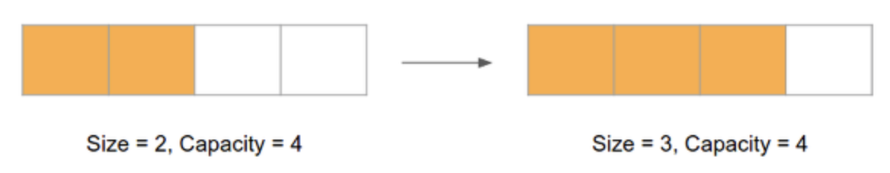
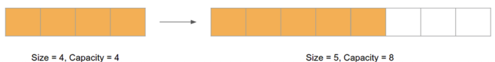
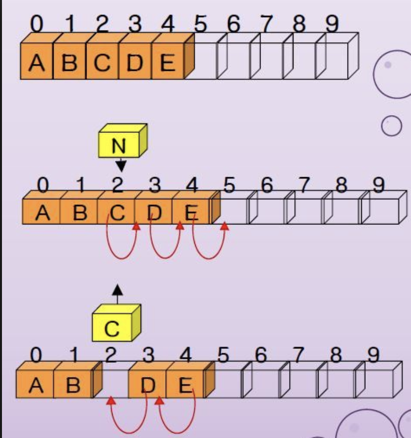
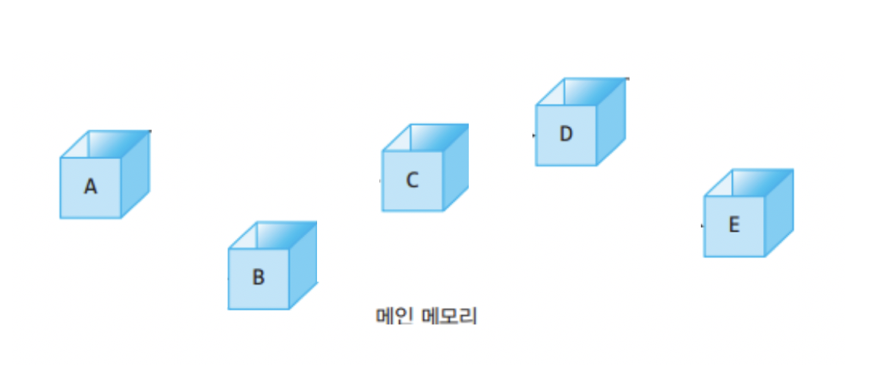
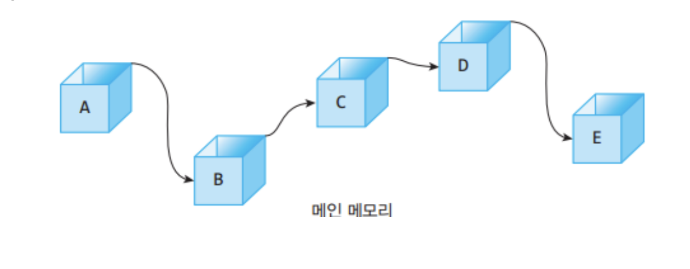
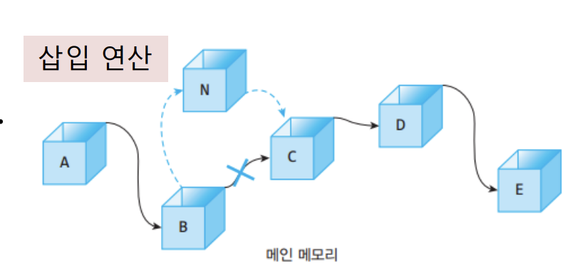
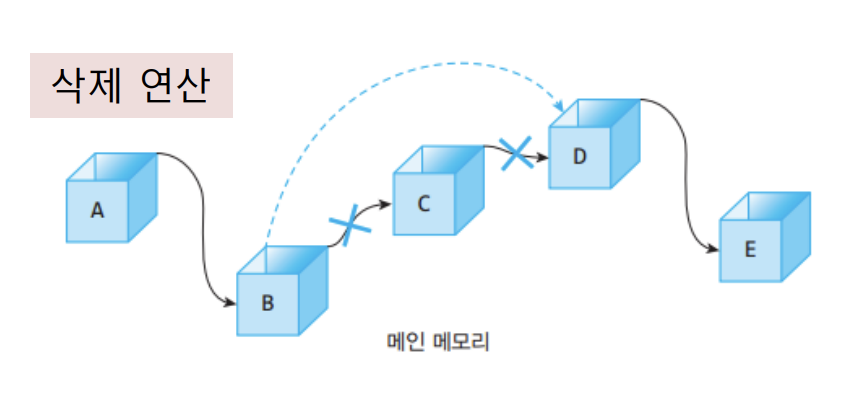

# **1. Dynamic Array**

>## 동적 배열이란 배열이 동적이란 뜻이다. 하지만 우리가 여태까지 사용했던 배열이 정말로 동적인지를 밑의 코드를 보면서 생각해 보고 배열의 ```문제점```에 대해서 생각해보자.

배열 선언 코드
```C  
int test[] = new int[10];
```
>## 배열의 문제
> #### 위의 코드를 보면 ``` 배열은 동적이지 않다 ```,처음에 변수를 선언과 동시에 메모리에 고정적으로 10개의 int 공간을 확보한다. 그렇기 때문에 불가피하게 10개 이상의 데이터를 초기화 해야만 하는 상황이 오더라도 더 입력할 수가 없다.
>## 해결 방안
> #### 배열의 크기를 선언한 이후로는 배열 공간이 더 필요 하더라도 사용할 수가 없기 때문에 이문제를 해결하기 위해 ```동적 배열```이 탄생한다.

> ## 동적 배열은 기존의 배열과 다르게 2가지의 특성이 존재한다.  
> #### 1. 배열의 크기를 **resize()** 하는 함수가 있고, 동작을 수행하는데 배열의 크기 N에 비례하는 시간이 걸린다.
> #### 2. 주어진 원소를 배열의 맨 끝에 추가 함으로써 크기를 1 늘리는 **append()** 함수가 존재하고, 상수 시간이 걸린다.   


> ## append() 
> ### 설명
> #### append()는 배열의 맨끝에 주어진 원소를 추가하면서 배열의 크기를 +1 하는 함수이다.
>### 문제점 
> ####  분명히 배열은 처음에 크기를 지정하면 늘릴 수 없다고 언급 했었는데, 위와 같은 동작은 불가능하다.
> ### 해결 방안 
> #### 그것을 해결 하기 위해서, 처음에 메모리를 할당 받을 때 배열의 크기가 커질것을 대비하여 여유분의 메모리(capacity)를 미리 할당 받아두는 것이다.


> ## 위의 그림 처럼 처음에 설정한 배열의 크기는 2이다. 하지만, 여유분을 생각해서 capacity를 4로 지정해 놓았지만, append 함수를 2번더 사용한다면 capacity 지점까지 배열의 크기가 늘어나 ```더 이상 append를 사용하여 배열의 크기를 늘릴 수 없다.```
> ### 문제점
> #### 하지만 capacity 까지 마저도 가득 차버리면 어떻게 해야될까 ?
> ### 해결방안
> #### 바로 그때 resize() 함수를 사용한다.

출처 : https://yoonpunk.tistory.com/8

> ### 위의 그림을 보면 처음 정해놓은 배열의 크기가 2였지만, 2개가 더 추가되어 한계치(capacity)인 4개가 되었다. 이럴땐 배열의 크기를 2배 늘려서 사용한다. 이 순서를 자세히 들여다 보면
> #### 1.이전 배열 크기의 2배인 새로운 배열을 생성한다.
> #### 2.그 이후 이전의 배열에 있던 항목들을 새로 생성한 배열에 복사한다.
> ## 위와 같은 방식으로 배열의 크기를 늘리고 있다. 하지만, 이전에 존재하던 배열을 새로운 배열로 옮기면서 작업 시간은 O(N)이 된다.

resize의 코드는 다음과 같다.
``` C
//배열의 용량이 가득 차면
if(size == capacity){
    //용량을 M만큼 늘려 새 배열을 할당받는다.
    int newCapacity = capacity + M;
    int* newArray = new int [newCapacity];
    //기존의 자료를 복사
    for(int i=0;i<size;i++){
        newArray[i] = array[i];
    }
}
```
>### 위의 재할당 과정에서 드는 시간은 O(N+M)이다.
>## append()의 시간은 상수이고, resize() 시간은 N인데 그럼 위의 시간 복잡도를 어떻게 구할 수 있을까?
>## append를 사용하면서 선형시간 O(N)이 걸리는 경우는 가끔 일어나는 재할당 과정 때 뿐이다. 그러므로 이전의 Big-O 단원에서 이야기한 상환 분석을 이용할 수 있다.


# **2. Linked List**
>## 배열 원소들의 순서를 유지하면서 임의의 위치에 원소를 삽입하거나, 특정 위치의 원소를 삭제할 때의 동작을 살펴보자.

출처 : https://robodream.tistory.com/169
> 위의 두번째 그림은 특정 위치에 새로운 원소를 입력하는 그림이고,   
세번째 그림은 특정 위치의 원소를 제거하는 그림이다. 위의 그림엔 5개의 원소밖에 존재하지 않지만 ``` 우리는 위의 배열 뒤로 100만개의 원소가 더 존재한다고 가정해보자```

> ### 임의의 위치에 삽입
> #### 위의 1000004개의 배열 원소중에, index[2]에 새로운 원소를 삽입한다고 생각해보자. 그러면 index 2 ~ 1000004에 있는 원소들이 오른쪽으로 한개씩 밀려나야 되는 상황이 발생한다. 
> ### 배열의 특정 위치의 원소를 삭제
> #### 위의 100만 4개의 배열 원소중에, index[2]에 있는 원소를 삭제한다고 생각해보자. 그러면 index 2 ~ 1000004에 있는 원소들이 왼쪽으로 한칸씩 옮겨져야 하는 상황이 발생한다.
> ### 겨우 한개의 입력 삭제를 위해 저렇게 많은 원소들이 이동(연산)해야 된다는 것은 굉장히 비효율적인 방법이다.

> ## ```위와 같은 배열의 문제를 해결하기 위해 Linked List가 탄생했다.```
>메모리에 분산된 원소들
>
> ### 배열에서는 메모리의 연속된 위치에 각 원소들이 존재 했다면, 연결 리스트는 위와같이 메모리에 분산되어 저장되어져 있다.
포인터로 연결된 원소들
> 
> ### 각 노드마다 다음 원소를 가리키는 포인터를 가지고 있어서 위의 그림과 같이 연결이 되는 방식이다.  ```가장 처음의 원소를 head``` , ```가장 마지막 원소를 tail이라고 한다.```

> ## 수행 방법
> ### 1.검색
> #### 연결리스트에서 i번째 노드를 찾아내기 위해선 head에서 tail까지 하나씩 찾아야 한다. 그렇기 때문에 ```검색을 위해 사용되는 시간은 리스트의 길이에 비례한다.```
> ### 2.입력
> 
>#### 위의 그림은 N을 삽입하는 그림이다. 
>#### 1. N이 들어갈 이전의 노드 B의 next를 N으로 둔다.
> #### 2. N의 next를 N의 다음 노드 C로 둔다.
> ### 3.삭제
> 
> #### 위의 그림은 C를 삭제하는 그림이다. 
> #### 1. 노드 B의 next를 노드 D로 둔다.
> #### 2. 노드 C를 삭제한다.
> ## 입력과 삭제 연산이 배열에 비해 굉장히 간단하다.


> ## 장점
> #### 1. 삽입 삭제가 배열에 비해 굉장히 간단하다.
> #### 2. 크기 제한이 없다.
> ## 단점.
> #### 1. 검색할 때 시간은 리스트의 길이에 비례하므로 비효율적이다.
> ## 추가 사항
> #### 삽입 삭제 거의없고, 배열의 끝에서만 이루어질 경우 동적 배열이 효율적이다. index로 인해 빠르게 임의의 값에 접근이 가능하고, 연속된 메모리 배치는 CPU 캐시의 효율을 높혀준다.
> #### 순회하며 삽입 삭제한다면 연결 리스트가 효율적이다.

