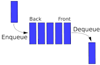

# **Stack**
> 1.설명 : 스택 자료구조는 말 그대로 쌓아 올린다(stack)의 의미를 갖고 있다.  

> 2.image  


> 3.특징 
>   - 한 쪽 끝에서만 자료를 넣거나 뺄 수 있는 선형 구조(LIFO - Last In First Out)이다.
>   - 스택이 유용한 경우는 재귀 알고리즘을 사용할 때다. 이부분은 밑에서 계속해서 다룰 예정이다.
>   - 문자열을 역순으로 출력할때, 연산자 후위 표기법 등에 쓰인다.


> 4.기본 함수
>   - push(item) : item 하나를 스택의 가장 윗 부분에 추가한다.
>   - pop() : 스택에서 가장 위에 있는 항목을 제거하고 반환한다.
>   - peek() : 스택의 가장 위에 있는 항목을 반환한다.
>   - isEmpty() : 스택이 비어 있을 때에 true를 반환한다.


> 5.코드
>   - 코딩 테스트에 자주 사용하는 경우가 있으니, 많이 사용해서 익혀두도록 하자! 
>   - 밑의 stack 코드는 LinkedList를 기반으로 구현 하였다.


```java  
public class MyStack{

//스택을 구성할 LinkedList에 사용할 노드이다.
    private static class StackNode{
        private T data;                 //노드안에 들어갈 데이터
        private StackNode next;         //다음 노드객체를 가리키는 포인터(top이라면 자신의 밑을 가리킨다.)
        public StackNode(T data){
            this.data = data;
        }
    }

    private StacoNode top;          //스택의 top

    public T pop(){
        //top == null 이라면 스택이 비어 있다고 에러
        if (top == null) throw new EmptyStackException();
        T item = top.data;          //top에 있는 아이템을 삭제하기 위해 tmp에 빼놓은 후에
        top = top.next;             //top을 현재 top.next로 변경해 준후에
        return item;                //tmp에 빼놓은 것을 반환.
    }

    public void push(T item){
        //입력 받은 값을 node에 넣어 생성.
        StackNode t = new StackNode(item);
        //생성한 노드의 next에 이전의 top을 초기화 한후에
        t.next = top;
        //새로 생성한 노드를 top으로 만들어준다.
        top = t;
    }

    public T peek(){
        //top == null 이라면 에러
        if (top == null) throw new EmptyStackException();
        //현재 top의 값을 반환
        return top.data;
    }
    
    public boolean isEmpty(){
        return top == null;
    }
}
 
```
> **6.노트**
>   - **스택의 재귀 알고리즘을 반복적 형태(iterative)를 통해 구현하는 연습을 해보자! 간단한 재귀 알고리즘을 반복적 형태로 바꿔서**  


# **Queue**
> 1.설명 : 매표소 앞에 서 있는 사람들이 움직이는 형태와 같이, 큐에 저장되는 항목들은 큐에 추가되는 순서대로 제거된다.  

> 2.image  


> 3.특징 
>   - 먼저 나온 데이터가 먼저 나오는 FIFO(First In First Out) 구조로 저장하는 형식이다.
>   - 변수로 front(head)와 rear(tail)이 존재한다. front는 dequeue 할 때 사용, rear는 enqueue 때 사용.
>   - 컴퓨터 버퍼에 주로 사용된다. 입력이 많아 처리를 하지 못할 때 큐를 만들어 대기시킨다.
>   - 너비 우선 탐색(breadth-first-search)을 하는 경우 또는 캐시를 구현 하는 경우에 종종 사용된다.


> 4.기본 함수
>   - enqueue(item) : item을 리스트의 끝 부분(rear)에 추가한다.
>   - dequeue() : 리스트의 첫 번째 항목(front)을 제거한다.
>   - peek() : 큐에서 가장 앞에 있는 항목(front)을 반환.
>   - isEmpty() : 큐가 비어 있을 때에 true를 반환한다.

> 5.코드
>   - 코딩 테스트에 자주 사용하는 경우가 있으니, 많이 사용해서 익혀두도록 하자! 
>   - 밑의 queue 코드는 LinkedList를 기반으로 구현 하였다.


```java  
public class MyQueue{

//Queue 구성할 LinkedList에 사용할 노드이다.
    private static class QueueNode{
        private T data;                 //노드안에 들어갈 데이터
        private QueueNode next;         //다음 노드 객체를 가리키는 포인터
        public QueueNode(T data){
            this.data = data;
        }
    }

    private QueueNode front;            //가장 앞에 있는 노드
    private QueueNode rear;             //가장 뒤에 있는 노드

    public void enqueue(T item){
        //enqueue를 할 때는 가장 뒤에(rear) 에 넣는다.
        
        //노드를 생성한 후에
        QueueNode t = new QueueNode(item);
        //큐가 비어있지 않다면
        if (rear != null){
            //마지막 노드의 다음 노드를 방금 생성한 노드로 놓고
            rear.next = t;
        }
        //마지막 노드를 방금 생성한 노드로 표시
        rear = t;
        //원래 비어있던 노드라면, front도 null이기 떄문에
        if (front == null){
            //front에 rear를 초기화
            front = rear;
        }
    }

    public T dequeue(){
        //dequeue를 할 때는 가장 앞에(front)에서 빼온다.

        //큐 비어있는지 확인
        if (front == null) throw new NoSuchElementException();

        //front에 있는 데이터를 임시변수에 빼놓고
        T data = front.data;
        //front에는 현재의 front.next(자신의 뒤에 있는) 노드를 초기화.
        front = front.next;
        // dequeue 한 이후 큐 안에 데이터가 남지 않았다면, 마지막 rear도 null로 초기화 해준다.
        if (front == null){
            rear = null;
        }
        //임시 변수에 빼놓은 이전 front 값을 반환.
        return data;
    }

    public T peek(){
        if (front ==null) throw new NoSuchElementtException();
        freturn front.data;
    }

    public boolean isEmpty(){
        return front == null;
    }
}
 
```

> **6.노트**
>   - **큐에서 처음(front)과 마지막 노드(rear)를 갱신할 때 실수가 나오기 쉬우니 염두해 두자!**


# **Recursive Function(재귀 함수)**
> 1.설명 
>   - 재귀의 뜻 : 원래의 자리로 돌아가거나 되돌아온다는 의미
>   - recursive : 결과를 얻기 위해 동일한 행위를 여러번 한다는 의미

위의 한글과 영어의 뜻을 종합한 결과 내린 결론은 재귀 함수란
## **함수 안에서 자기 자신(앞에서 말한 함수)을 호출하는 함수이다** 


> 2.특징

>장점
>   - 코드의 길이가 짧아진다. 
>   - 구현하기 쉽다. 

>단점  
>   - 반복문에 비해 시간이 비교적 많이 걸린다.
>   - 함수가 스택에 계속 쌓이기 때문에 공간 복잡도가 올라간다.

> 3.재귀 함수에 필요한 요소
>   - Recursive call(재귀 함수)
>   - Base Case(끝내는 조건)
>   - 일정 부분 하는일이 있어야함(basecase에 조건으로 사용된 변수의 크기가 변경 된다던지)


>4. 위의 3번에서 재귀 함수에 필요한 요소를 코드를 보면서 설명 하려고한다. 3가지 요소 중 재귀 함수만 사용해보자.


```java  
void Recursive(){
System.out.println("hello!");
//recursive call
Recursive();
}

void main(){
    recursive();
} 
```
재귀함수만 있을때 위의 코드를 실행 시키면 결과값은 밑과 같을 것이다.  
hello  
hello  
hello  
.  
.  
.  
무한 반복.  
함수를 종료 되지 않는다.  

그렇기 때문에 우리는 basecase를 넣고, basecase에 조건으로 사용된 변수를 변경하는 코드를 작성해야한다

밑의 코드는 위에서 말했던 세가지 재귀함수의 필수 요소가 존재하는 코드이다.

```java  
void Recursive(int cnt){
System.out.println("hello!");

cnt--; //basecase에 사용된 변수를 변경.

//이부분이 basecase
if(cnt <1 ){
    return;
    }

//recursive call
Recursive(cnt);
}

void main(){
    recursive(3);
} 
```

위의 코드를 cnt = 3으로 실행 시키면
cnt = 2가 되고, 2<1 이므로 종료하는 조건에 맞지 않으므로 print hello   
cnt = 1가 되고, 1<1 이므로 종료하는 조건에 맞지 않으므로 print hello   
cnt = 0가 되고, 0<1 이므로 종료하는 조건에 맞으므로, return.

위의 결과 값과 같이 총 2번 찍힌 이후에 종료될 것이다.

> **5.노트**
>   - **평소에 코딩할 때는 재귀함수를 거의 사용하지 않는다. 정리 이후에, 재귀함수를 작성하는 연습을 해야겠다.**
