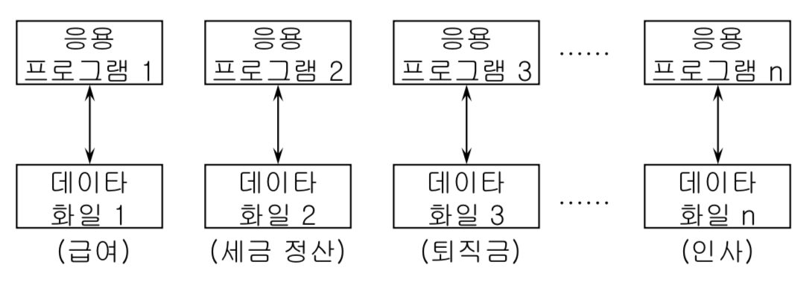
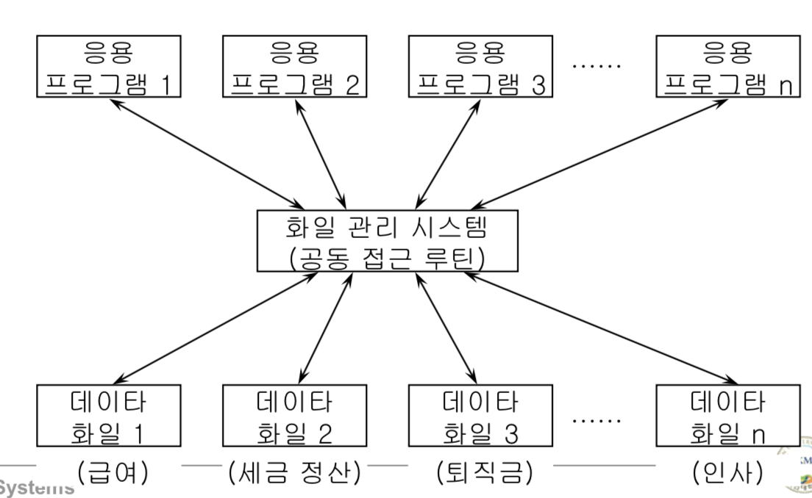
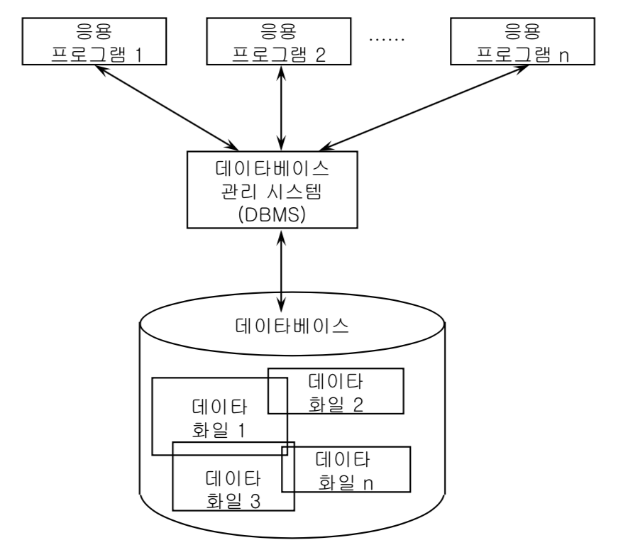
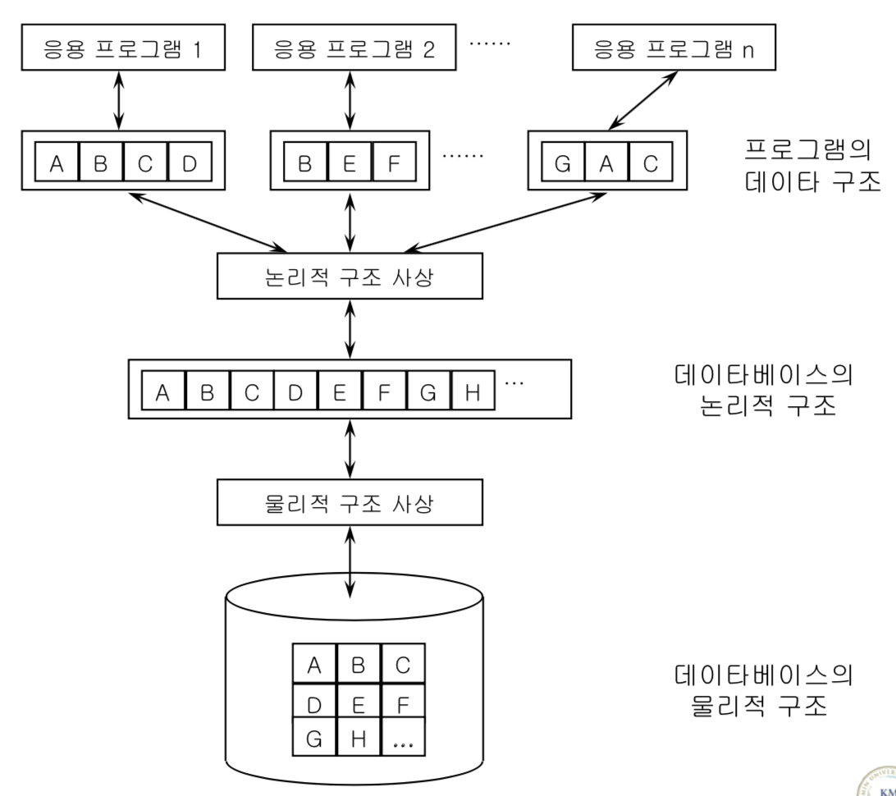

# 데이터 베이스 관리 시스템

DB<- 4가지 조건을 갖춘 데이터의 모음.(hdd에 존재.)
DBMS : DB를 운영하는 소프트웨어 패키지
## 1. DBMS의 발전 배경
- 파일 시스템이란  
디스크의 저장된 데이터를 관리하는 관리자

 ### 과거의 파일 처리의 한계와 solution

> 
> 1.한계 : 처음에 응용 프로그램이 사용하는 데이터들이 파일화 되어 각각의 응용프그램들 마다 존재했었음. 그래서 각각 파일이 hdd에 파일을 접근해서 해야 됬다.

> 
> 2.solution : 그렇기 때문에 화일 관리 시스템을 만들어, 중앙 관리를 하였다. 그러면 위의 방법 보다 파일을 접근하는 것이 쉬워졌다. OS의 영역이다.

## 2. 파일 시스템의 문제점
> 1. data dependency(데이터 종속성) : 위의 그림에서 데이터 화일1의 **데이터 구조**가 변하면, 응용프로그램1도 변경해줘야한다. 다른말로, 응용프로그램은 데이터에 종속적이다 라고 할 수 있다.

> 2. data redundancy(데이터 중복성) : 데이터가 중복된다면 큰 문제들이 생긴다. 하지만 데이터가 중복 되더라도, 파일 시스템은 관여할 수 없다.
## 3. DBMS의 정의
>1. 정의 : 위의 문제에 대한 솔루션으로 나온 것이 DBMS이다.  

> 
>2. 특징
> - 데이터의 중복성 문제 해결  
> - 데이터 종속성 문제 해결 : 구조의 많은 부분을 바꾸지 않으면 응용 프로그램을 변경할 필요가 없다.
## 4. DBMS의 필수 기능  
> 1. 정의 기능(data definition)   
> - 다양한 형태의 데이터 요구를 지원할 수 있도록 가장 적절한 데이터베이스 구조를 정의할 수 있는 기능. 
> - 이후에 정해놓은 구조에 맞게 데이터가 쌓인다.
> 2. 조작기능(data manipulation)
> - 사용자와 DB사이의 인터페이스를 위한 수단
> - 크게 두가지로 나뉜다.  
>        - 검색 : retrieval(검색)(query)   
>        - 갱신 : modify, insert, delete
> - 사용자의 요구에 따라 DB를 접근하고 조작
> 3. 제어기능(data control)  
> - 특징  
>       - 가장 어려운 부분이다. 수업에선 이 부분은 자세하게 다루지 않는다.
> - 요건  
>       - 무결성 유지 : 저장된 데이터에 결함이 절대 없어야함.  
>       - 보안, 권한 검사 : DB의 사용자들에게 권한을 부여하여, 사용자 마다 접근을 제한한다.  
>       - 병행 수행 제어(concurrency control)  
## 5. DBMS의 장단점
> - 장점  
>       - 데이터 중복 최소화   
>       - 데이터 공용 :  
>       - 데이터의 일관성 :     
>       - 데이터의 무결성 : DB안에 있는 데이터들 끼리 모순이 없어야한다.    
>       - 데이터 보안 보장 :   
>       - 표준화 : 기업 내에서 사용할   데이터의 표준    
>       - 전체 데이터 요구의 조정   
  
> - 단점  
>       - 관리해야 할 사람을 고용하므로 운영비 증대  
>       - 자료처리의 복잡화 : 부서 내에선 사용하기 편했는데 회사 전체를 하기 위해 통합하려면 자료가 복잡해질 수 있음.  
  
>       - 복잡한 백업과 복구 : 은행에서 백업을 한번 하기 위해선, 오랜 시간동안 서비스 중단. (고난이도 기술.)  
>       - 시스템의 취약성     
## 6. 데이터 독립성(data independency)

> 
> 1. 물리적 데이터 독립성
>   - DBMS 관리자가 바라보는 구조
>   - 물리적 구조가 변하더라도, 논리적 구조에 영향을 미치지 않는다.
> 2. 논리적 데이터 독립성
> - 응용프로그램이 변하더라도, 논리적 구조에 영향을 미치지 않는다.
>   - 순수하게 응용프로그램에서 바라본 구조