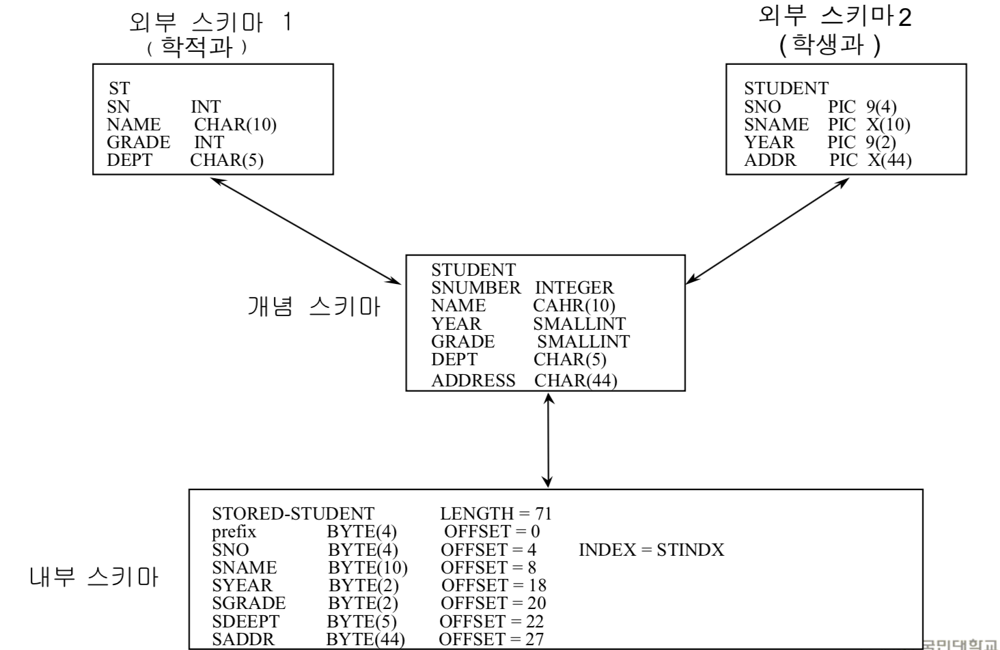

# 구성요소 
> 1. 3단계 스키마
> 
> 스키마란 : schema==format, 데이터베이스의 구조(데이터 객체, 관계) 와 제약 조건의 명세
> - 외부 단계(external schema) : 각 부서가 갖고 있는 것들.
> - 개념 단계(conceptual schema) : extrenal을 통합해서 하나로 만들어 놓은것.
> - 내부 단계(internal schema) : 개념 단계가 물리적으로 스토리지에 어떻게 저장할지.

학적과 : 학적을 관리
학생과 : 학생이 학교 잘 다닐 수 있도록 관리

위의 그림을 보면 학생을 바라보는 관점이 서로 다르다. 그러다 보니 동일한 것들도 이름이 다르고 ,다른 컬럼도 존재한다.

밑의 것은, 명명을 표준화하여 한개의 테이블에서 관리할 수 있음을 나타낸다.

스토리지에 저장될땐 무조건 byte로 저장됨.
학번은 index로 btree로 관리한다.
인덱스를 유지하기 위해선 스토리지도 많이 차지, 굉장히 복잡해 지기 때문에 필수적일때만 사용한다.
