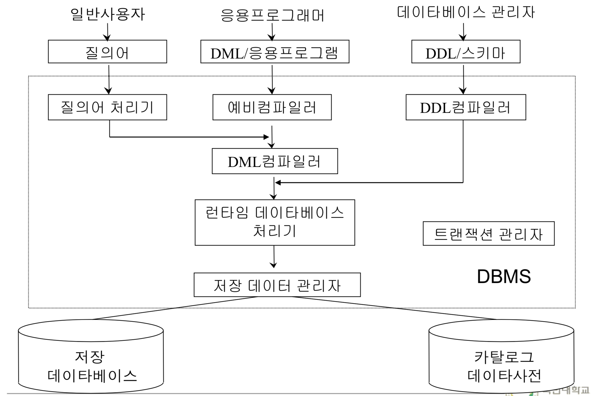

# 구성요소 
> ## 1. 3단계 스키마
> 
> 스키마란 : schema==format, 데이터베이스의 구조(데이터 객체, 관계) 와 제약 조건의 명세
> - 외부 단계(external schema) : 각 부서가 갖고 있는 것들.
> - 개념 단계(conceptual schema) : extrenal을 통합해서 하나로 만들어 놓은것.
> - 내부 단계(internal schema) : 개념 단계가 물리적으로 스토리지에 어떻게 저장할지.

> 그림에 대한 간단한 설명이다.  

>학적과 : 학적을 관리
>학생과 : 학생이 학교 잘 다닐 수 있도록 관리

>위의 그림을 보면 두개의 부서는 학생을 바라보는 관점이 서로 다르다. 그러다 보니 동일한 것들도 이름이 다르고 ,다른 컬럼도 존재한다.(external schema)

>가운대 것은, 명명을 표준화하여 한개의 테이블에서 관리할 수 있음을 나타낸다.(conceptual schema)

>마지막은 물리적으로 스토리지에 저장될 스키마이다.(internal schema)

스토리지에 저장될땐 무조건 byte로 저장됨.
학번은 index로 btree로 관리한다.
인덱스를 유지하기 위해선 스토리지도 많이 차지, 굉장히 복잡해 지기 때문에 필수적일때만 사용한다.

## 테이블의 정의란 ? 
entity(record) type을 정의하는것.

> ## 2. Data Language(SQL)
> ###  데이타 언어 종류
>   - **DDL(Data Definition Language)**
>   - **DML(Data Manipulation Language)**
>   - DCL(Data Control Language) 안배운다.

> ### 1. DDL
>   - entity 타입을 정의하는 언어        
> ### 2. DML  
>   - 조작하는 언어  
>   - 예 : 검색, 갱신(삽입,삭제,수정)  
>   - 절차적 언어(procedural)  
>>  - **what to do과 how to do를 명세**  
>>  - ex) 만원 줄태니 예대매점 가서 커피 한잔 사오고  거스름돈은 너 가져  
>>   - 비절차적 언어(non-procedural) : **what to do **만 명세 .  
>>>   -  ex) 커피 뽑아와  
>>>   - **SQL은 비절차 언어이다!**  
> ### 3. DCL  (안배울것임)  
>>   - DB의 접근을 제어 하는 것, 백업, 복구  
>>   - ex) 유저에게 접근할 수 있는 권한을 제공  
> 데이터 부속어(DSL,Data subLanguage) : 호스트 프로그램 속에 삽입되어 사용되는 DML  
>> - ex) 자바로 코딩하고, 데이터배이스 접근할때마다 SQL를 넣는것.

  
> ## 3. User
> ### 1. 사용자 종류
> 1. 일반 사용자(end user)
>> - ex) ATM 기계 이용자. 전 국민.
> 2. 응용 프로그래머(application programmer)
>> - host 언어(java,c) + DML을 통해 DB에 접근.
>> - 개발자
> 3. 데이터베이스 관리자(DBA)
>> - DDL + DCL 을 통해 DB를 정의하고 제어하는 사람.

> ## 4. DBMS
> 
> 위의 그림의 중요한 부분은 밑에 DBMS와 이어지는 저장 데이타베이스와 카탈로그 데이터 사전이다(dictionary).
> dictionay는 entity type의 정의가 존재한다.
> database에는 entity type으로 정의된 entity instance들이 존재한다.
> ## 5. DBA
> ### 1. 설명 : 데이타베이스 시스템의 전체적인 관리운영에 대한 모든 책임을 지는 사람의 집단.
> ## 6. Hardware
> ### 1. 이전에는 사용 했지만, 요즘엔 하드웨어가 너무 좋아짐
> ### 2. DB의 성능을 올리기 위해서 ram의 크기를 키워야한다.