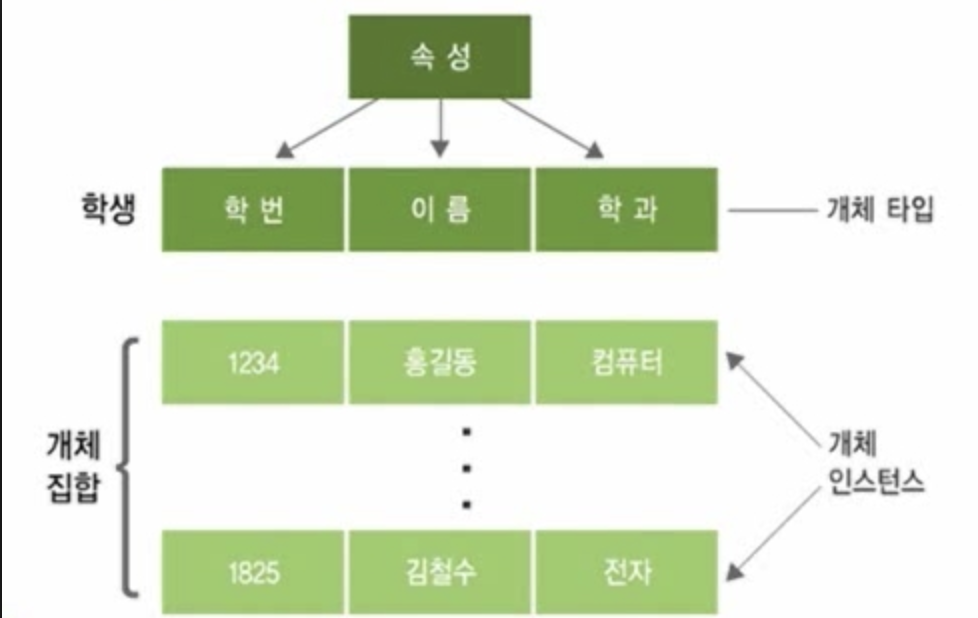
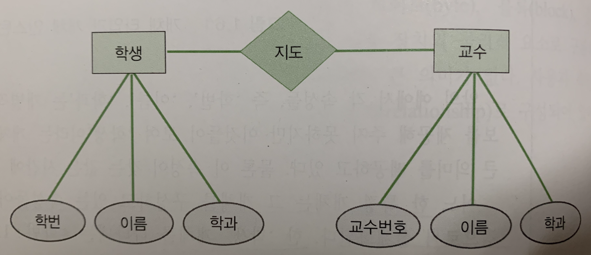

학교 수업 내용을 듣고 정리하는 글이라서 그런지, 글을 재미있고, 스토리가 있게 작성하는것이 시간도 오래걸리고, 쉽지만은 않은것 같다.
재미있진 않더라도, 내가 이후에 이전에 공부했던 것들을 다시 보러 왔을때 어떤 건지 이해가 될 수 있도록 쉽게 정리해 보려고 노력해보려고 한
# **Database란 ?**
일상 생활에 살면서 굳이 컴퓨터 과학 전공생이 아니더라고, Database란 용어는 일상생활에서도 자주 듣는다.
database라는 용어는 원래는 data + base 로 서로의 의미를 가진 언어였지만, 이제는 한개의 단어로 부른다고 한다.
database에는 정말 많은 data 들이 존재한다. 현재 왠만한 거의 모든 서비스는 데이터를 DB에 축적하고 있고, 일단 많은 데이터를 쌓아 놓는다.
이러는 이유가 뭘까? 히스토리를 남겨 이전의 행위들을 추적하거나 또는 다른 용도로 남겨 놓는 이유도 있을 것이다.
하지만 요즘엔 이러한 데이터를 기반으로, 유용한 정보들을 생상하여, 서비스에 이용하는것을 많이 볼 수 있다.
e-커머스 또는 유튜브를 하다보면, 계속해서 내가 좋아할 만한 것들을 추천해준다. 이런 추천 서비스는 많은 데이터를 정제하여, 정보를 만들어, 
그 정보를 기반으로 서비스를 제공하는것이다.

위의 글을 정리해 보면, 
Data의 특징은 양이 방대하고, 그 자체로는 유용하게 사용할 수가 없다.
information의 특징은 방대한 양의 data로부터 뽑아낸 것으로, 목적을 갖고 만들어진 것이다.

위에서 말한 information 을 이용한 서비스가 많은 수익을 내면서, bigdata, AI 분야가 굉장히 이슈화 되고 있다.
그럼 big 데이터란 어떻게 생겨난 용어일까 ?

이전에는 Large Data 또는 very large data라는 용어로 사용을 했다. 하지만 지금 사용하는 big data와는 의미가 다르다.
이전의 시대에는 초연결 시대가 아니었다. 네트워크가 이렇게 발전하지 않았었고, 지금처럼 많은 정보도 존재하지 않았다.
그래서 위의 용어들은 한 컴퓨터 내에 많은 정보들이 존재한다는 것을 의미한다.
하지만 지금은, 위에서 말한 이전에 없었던 다양한 조건들을 갖추고 있다. 
그래서 네이버나 구글 같은 sw 기업들은 방대한 양의 데이터를 저장하기 위해 데이터 센터라는 거대한 스토리지 센터를 구성하고 있다.
한대의 스토리지가 존재하는게 아닌 몇천 몇만 혹은 몇십만대의 스토리지로 이루어져 있는 것이다.
바로 이런 많은 컴퓨터(스토리지)로 부터 데이터를 관리 운용하는 분야를 bigdata라고 한다.

이렇게 많은 데이터로 인해 만들어진 정보들은 사람들이 의사결정하는데 사용된다.
밑은 그 순서에 대한 그림이다.

현실 -> data -> process -> 정보 -> 의사결정
                       -> DB
1. 현실의 데이터는 컴퓨터가 통제 할 수 있는 형태(data)로 변환된다.
2. 데이터는 프로세스로 인해 DataBase에 저장된다.
3. process는 필요하면 database로 부터 데이터를 정제하여 정보를 만든다.
4. 그 정보를 기반으로한 의사결정을 내린다.

다음으로 처리 방식에 대해서 이야기 해보려고 한다.
크게 3가지로 분류할 수 있다.
1. 일괄 처리(Batch processing) 시스템
2. 온라인 처리 시스템
3. 분산 처리 시스템

>1. 일괄처리 시스템이란 컴퓨터가 많지 않던 시절 많이 사용하던 처리 방식이다. 이러한 방식은 후불 버스 카드를 생각해 볼 수 있다.
후불제 버스 카드는 버스에 탈 때마다 카드의 잔액이 빠져나가는 것이 아니라, 한달동안 쌓아 놓고, 정해진 일에 한번에 청구가 된다.
이러한 방식은 사양이 낮은 컴퓨터도 무난하게 처리할 수 있다. 시스템에겐 정말 편한 시스템이다.  
>2.온라인 처리 시스템이란, 실시간으로 처리하는것을 의미한다. 예를 들어보면 은행의 ATM 처리 방식을 들 수 있다. 내가 내 계좌에서 돈을 출금하면,
은행의 잔액 DB에서는 실시간으로 적용시킨다. 이러한 처리는 컴퓨터 사양이 좋아야 하고, 사용자들에게 정말 편한 시스템이다.  
>3.분산 처리 시스템은 DB가 분산되어 있다고 생각하면 된다. 예를들어 대전, 서울,부산에 나누어져 있기 때문에, 서울의 DB센터가 장애가 생기더라도, 
다른 지역의 DB로 부터 데이터를 가져와 서비스를 할 수 있기 때문에 피해를 최소화 할 수 있다.

## 이제는 Database에 대해서 이야기 해보려고 한다.

밑의 4가지 특성을 가지면 데이터 베이스라고 인정할 수 있다.
>1. Integrated data(통합 데이터)
>   - 최소의 중복(minimal redundancy)
>   - 통제된 중복(controlled redundancy)
>위의 특징은 데이터 베이스의 내부를 구성할 떄 중복된 데이터가 최소한으로 있도록 하고, 어쩔 수 없이 있더라도, 통제 하에 있는것을 의미한다.

>2. Stored data(저장 데이터)
>   - 컴퓨터가 접근 가능한 매체에 저장 해야한다.

>3. Operational data(운영 데이터)
>   - 한 조직의 고유 기능을 수행하기 위해 필요한 데이터

>4. shared data(공용 데이터)
>   - 한 조직의 여러 응용 프로그램이 공동으로 소유, 유지, 이용하는 데이터

다음은 DB의 특성이다.
>1. real-time accessibilities(실시간 접근성)
>   - 질의에 대한 실시간 처리 및 응답이 가능하다.
>2. continuous evolution(계속적인 변화)
>   - 갱신, 삽입, 삭제가 가능하다.
>3. concurrent sharing(동시 공용)
>   - 여러 사용자가 동시에 사용한다.
>4. content reference(내용에 의한 참조)
>   - 위치나 주소가 아닌 값에 따라 참조.

DB의 구성요소
>1. 물리적 구성 요소로 시스템의 입장에서 4가지로 구성된다.
>   - Bit : 0 또는 1
>   - byte : bit가 8개 모여있는 형태
>   - block : 기억이 안난다.
>   - cylinder : HDD 형태를 보면, 여러개의 디스크가 쌓여있는 형태를 실린더라고 한다  

 
논리적 구성요소 
>2. 사용자의 입장에서 DB에는 **개체**와 **관계**라는 두가지 요소가 존재한다.
>   - **개체(entity)** : 표현하려는 유무형 정보의 객체(object)이다. 개체는 하나 이상의 attribute를 가진다.
>       * **entity type** : 개체 내의 속성들의 타입을 의미한다. 학번 이름 학과의 data type(integer, string)
>       * **entity instance** : 정해진 entity type을 기반으로 생성된 데이터들을 의미한다. 학생 개체를 나타내는 [학번 : 1234, 이름 : 홍길동, 학과 : 컴퓨터]는 개체의 한 값으로 entity instance라고 한다.
 

>   - 관계(relationship) : 관계는 attribute relationship과 entity relattionshp으로 나뉠 수 있다.  
>      * attribute relationship(속성 관계) : 한 개체를 기술하는 속성들 간의 관계, 개체 내 관계라고도 한다.(intra-entity relationship)
        
>      * entity relationship(개체 관계) : 개체 집합 사이의 관계를 나타내는 관계, 개체간 관계라고도 한다.(inter-entity relationship)
  
위의 그림을 E-R 다이어그램(entity-relationship diagram)이라 한다.