# Modeling  
 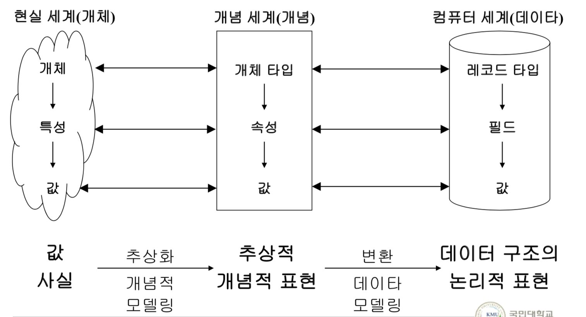
## 3개의 데이터 세계가 존재한다. 
reality(현실 세계) :  entity, relationship 존재한다.

conceptual(개념 세계): ```entity type```, relation type 으로 존재한다.

incomputer(컴퓨터 세계) : ```record type```으로 존재한다.

## 데이터 모델링이란 ?  
현실 세계의 데이터를 컴퓨터로 넣고 싶을때 어떤 단계로 넣을것인가 ?
기업 입장에서 봤을때 모아야 할 정보를 꺼내는 것이 모델링이다.
현실세계 데이터를 DB에 넣지 못하기 때문에, 모델링
을 거쳐 넣는다.
 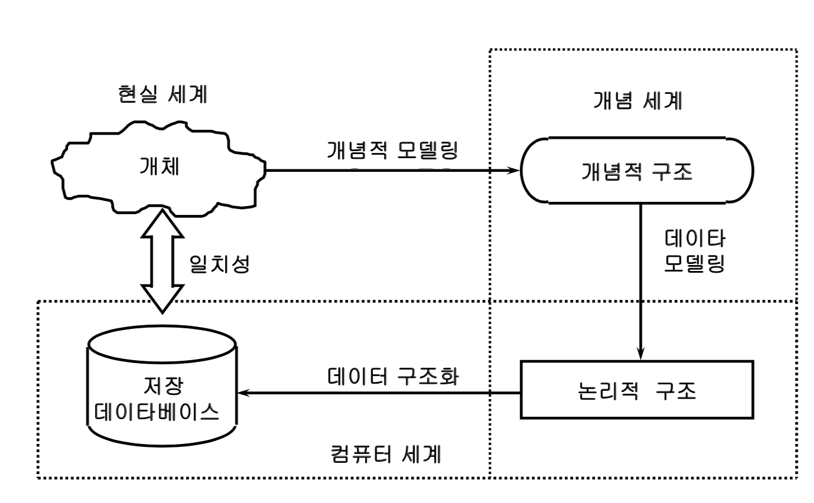

## 모델링
- 개념적 설계(conceptual design)   
    - 개념적 모델링 : 개념적 표현  
    - entity type  , relation type
- 논리적 설계(logical design)  
    - 데이터 모델링 : 논리적 표현  
    - record type
- 물리적 설계(physical design)  
    - 데이터 구조화 : 구현  
    - 저장 장치에서의 데이터 표현  


## 데이터 모델 개념  
D = <S,O,C>
- S : 데이터 구조(structure)
- O : 연산(Operation)
- C : 제약 조건(contraint)

## 개체 타입(entity type)  
attribute
- simple attribute , 
    - 학번,이름,학과는 더 쪼갤수가 없다.
    - 주소 같은 경우, 경기(도)/ 파주(시)/ 법원(읍)/가야(리)로 나누어져 있다. 한개의 주소를 나눈것을 simple attribute라고 한다.
    - 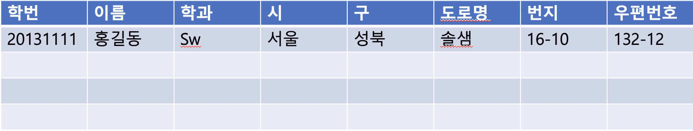
- composite attribute
    - 주소 : 경기도 파주시 법원읍 가야리.
    - 위의 주소와 같이 여러개의 데이터가 붙어있을 경우.
     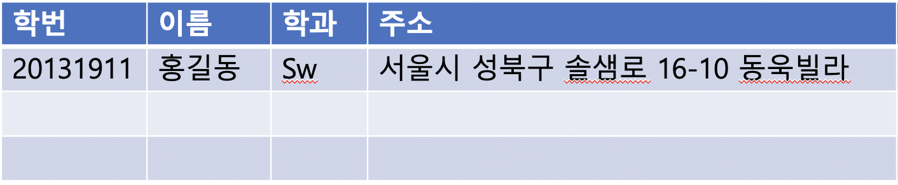

- single-valued
    - 학생의 주소에 대한 값이 한개밖에 없을 때
    - 학번,이름,학과
- multivalued
    - 학생의 주소에 대한 값이 3개 있을때 
    - 친구값이 여러명 있을 때
      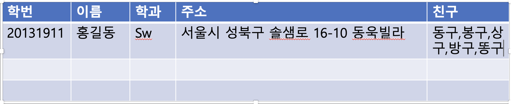
- stored attribute(저장)
    - 학번,이름,학과,주소,친구 등은 변하지 않음.
    
- derived attribute(유도)
   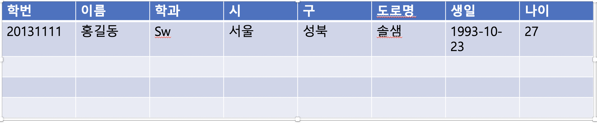
    - 생일과 나이가 attribute로 있을 때, redendunce 하다.
    - 계산해도 되는 값을 DB에 넣으면, 시간이 지나면, 잘못된 값이 된다.
    - 생일이 지나면, 나이가 변하지 않으면 문제가 된다.
    - 이런건 value를 저장하는 것이 아니라, 수식(정의를 저장해야 한다.)
    
- null attribute 
    - 특징
        - 어떤 값도 넣을 수 없을 경우.
        - 주소가 없을 경우 모를 경우 넣을 경우.
    - 예
        - 성별과 임신 여부 또는 군필 여부를 생각해보자.
        - 남자에게 임신여부를 false를 사용안함.
        - 여자에게 미필이란 용어를 사용하지 않음.
        - 시험 점수에 0점, 시험 보지 않은 애들
        - 이런 경우에 null 값을 적용한다.


## Realationship Type(관계 타입)
- 개체 집함들 사이의 대응성?
- mapping 
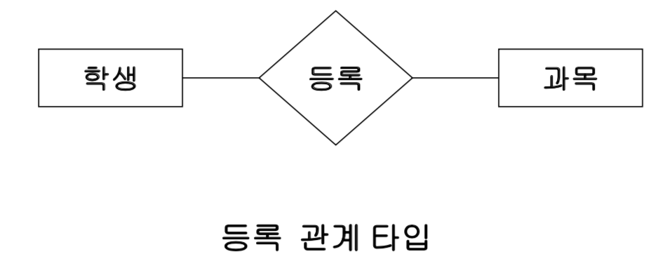
- 위의 그림과 같이 학생과 과목에는 관계가 있다. 학생이 어떤 과목을 듣는지에 대한 것이다.    

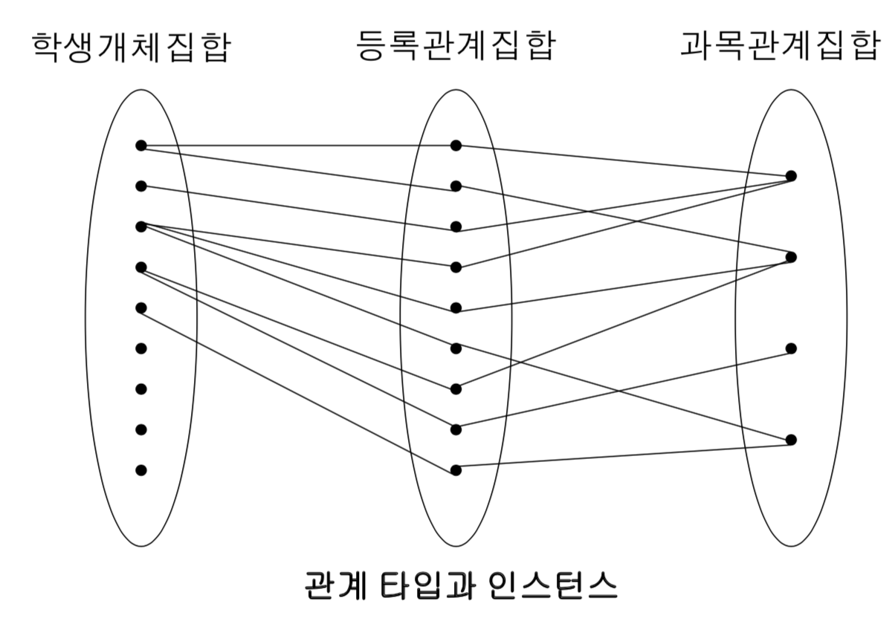
  
- 예제1
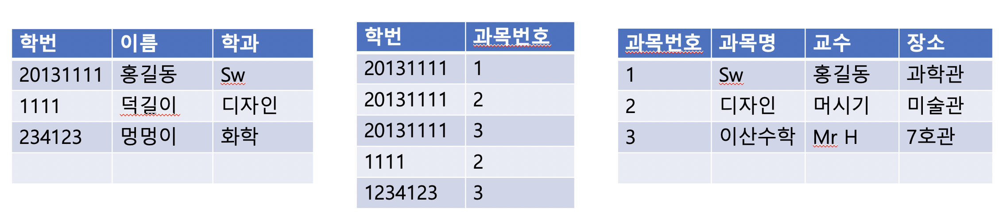
    - 학생 테이블, 등록 테이블이, 과목 테이블이 존재한다.
    - 등록은 학생이 어떤 과목을 수강중인지에 대한 테이블이다.
    - 학생 테이블 : 학생의 데이터가 존재(학번 : key attribute) entity type으로부터 생성된 테이블
    - 과목 테이블 : 과목 정보가 존재(과목번호 : key attribute) entity type으로부터 생성된 테이블
    - 등록 테이블 : 학번과 과목을 식별할 수 있는 데이터만 존재한다.(학번,과목번호) relation type으로부터 생성된 테이블  

    결국 entity type이나 relation type이나 record type(table이 나온것이다.)로 표현된다.
     
    현실 세계(개념적) : entity type, relation type  
    logical(논리적) : record type  
      
    - 등록 테이블이 의미하는것은 어떤 학생이 무슨 과목을 수강중인지 알 수 있다. 서로가 갖는 다른 데이터는 등록 테이블에 있지 않다.


## mapping의 원소 수(cardinality ratio)

- 1:1 (일 대 일) : 부부와의 관계
- 1:n (일 대 다) : 엄마와 자식관의 관계
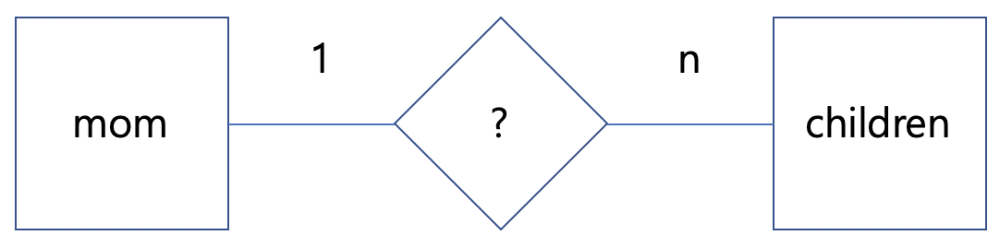
- n:1 (다 대 일) : 자식과 엄마와의 관계(위와 사실 동일)
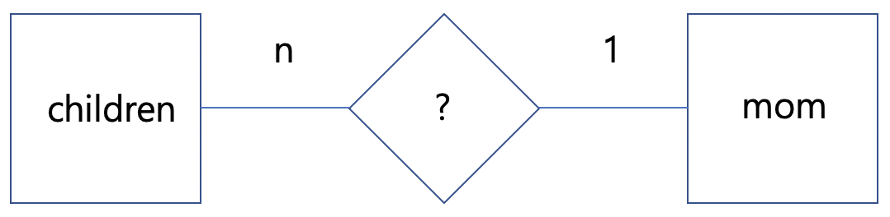
- n : m (다 대 다) : 학생과 과목 

    -  학생과 과목의 관계는
    - n:1
    - 1:n 둘다 되므로 다대다이다.

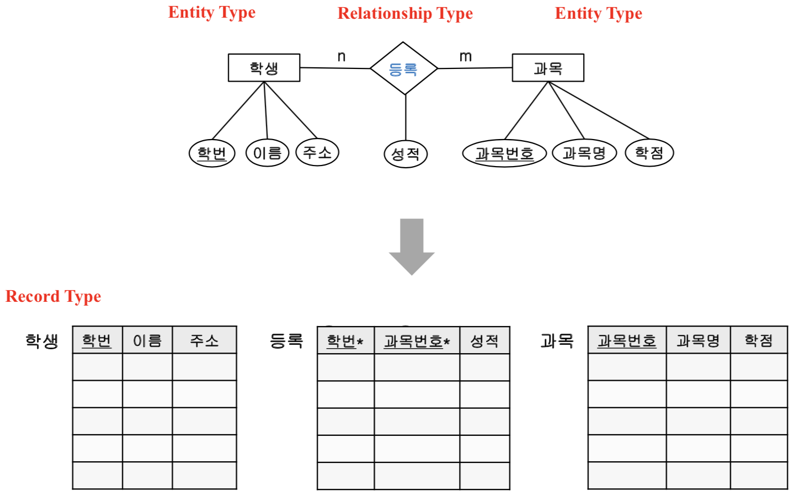
key attribute : unique하다. 식별 값임.
Relationship Type도 attribute를 갖는다.
등록은 양쪽의 key attribute로 구성되어져 있고, 성적이 추가되어져 있다.  
개념적 세계에서는 entity type이라하고 논리적 세계에서는 record type이라 한다.

**학생과 등록에서 학번은 unique key가 있다
등록에서 학번(* 붙은)은 학생의 학번중 하나로 입력이 되어야 한다.**

- Primary Key(기본키) PK : 동일한 값이 존재하면 안된다.
    - 학생의 학번을 primary key라고 한다.
- Foreign Key(외래키) FK : *로 표현하고, 주체의 primary key를 사용해야 한다는 제한이 잇다.
    - 등록에서의 학번(*붙은)을 외래키라고 한다.
    - 위에서 등록 테이블은 primary키가 없기 때문에, 학번, 과목번호를 가지고는 특정 한개의 데이터를 받을 수 없다. 그렇기 때문에, 외래키로 사용된 두가지의 키를 모두 사용해야 primary 기능을 할 수 있다.


 - Mapping(사상의 참여?)
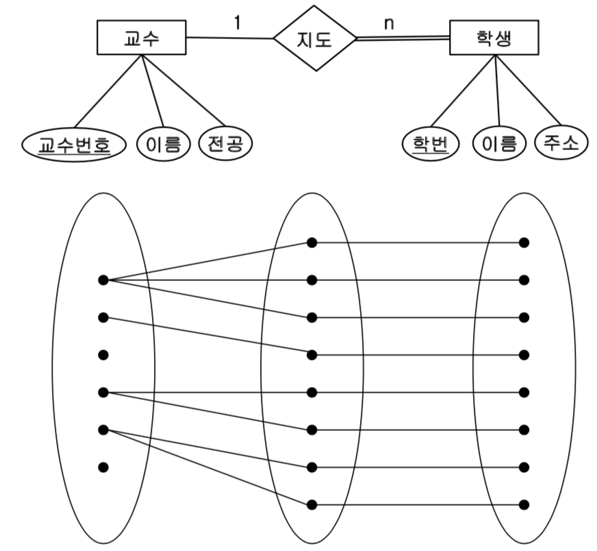
    - 전체 참여
        - 모든 학생들은 교수들에게 지도를 받고 있기 때문에, 이것을 전체 참여라고 한다.
        - E-R 벤다이어그램에 교수 지도 학생의 선에 n은 전체 참여를 나타낸다.
    - 부분 참여
        - 위의 그림과 같이 2명의 교수가 학생을 지도 하지 않고 있는것을 부분참여라고 한다.
        - E-R 벤다이어그램에 교수 지도 학생의 선에 1은 부분 참여를 나타낸다.
    - 위의 그림에서 첫번째 교수가 빠진다면? 그 지도교수의 학생들은 DB로 부터 삭제되야한다. 또는 다른 교수로 이어주던가 해야함.
    - 밑의 벤다이어그램을 보면서 배운걸 생각해보자.
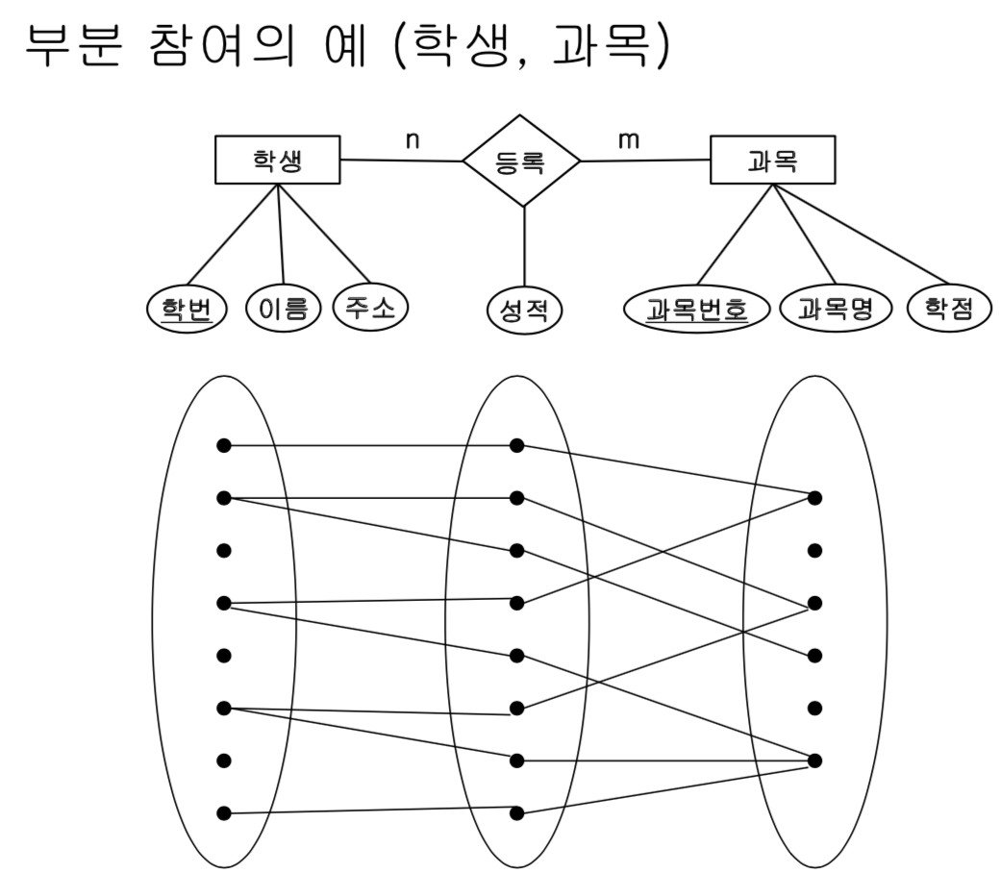
   
    

## 5. 개념적 설계 : 개체-관계 모델(ENTITY-RELATIONSHIP MODEL)
현실 세계를 개념적으로 표현하는것이다. 개체 타입과 관계타입을 기본 개념으로 현실 세계를 개념적으로 표현하는 방법이다.

- 1.E-R 다이어그램
    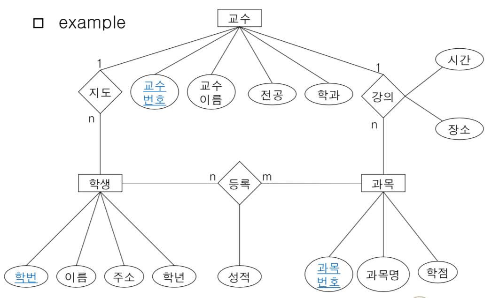
     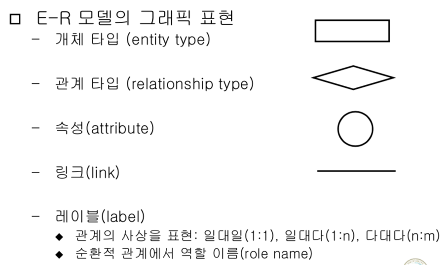
- 2.Key Attribute()
    - 개체 타입내의 모든 개체 인스턴스들을 유일하게 식별하게 하는 값. 동일한 키 값을 갖는 두 개의 객체 인스턴트는 존재하지 않음.
    - 벤다이어그램에서 밑줄로 표시

- 예제
    - 릴레이션에는 대부분 attribute에는 없지만, 있는 경우도 있다.
- 3.E-R 다이어그램 특징
     - 1.Relation Type도 속성을 갖는다.
     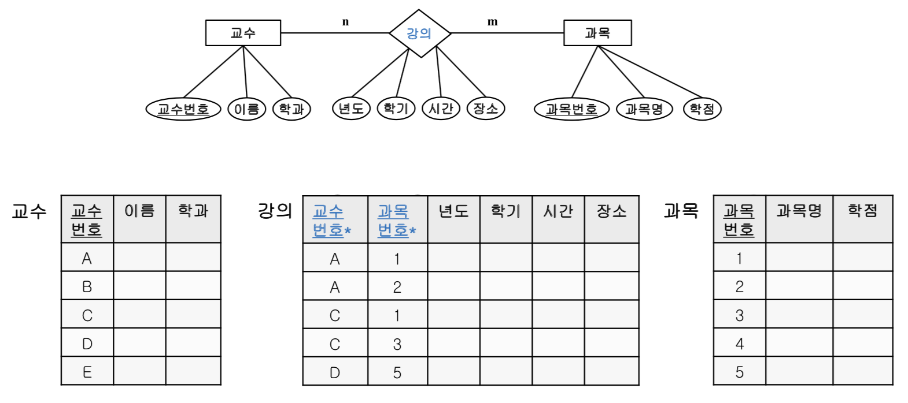
     - 2.다대다 관계 표현
     - 3.다원 관계표현(n-ary relationship)
     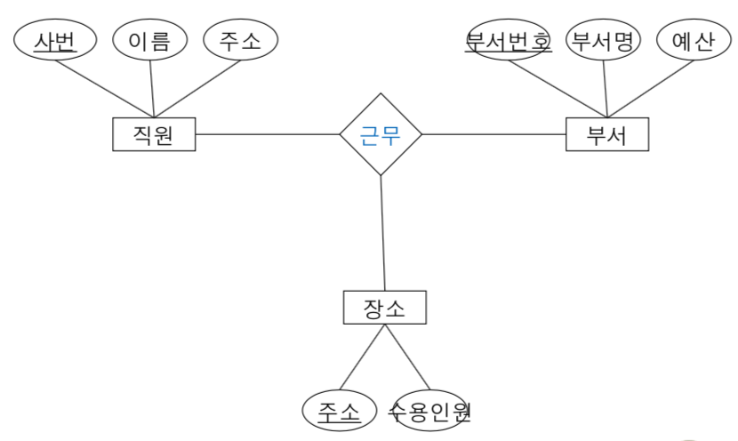
        - 위의 그림은 3진 관계이다.
        - 근무의 데이터는 3팀의 홍길동이 국민대에서 근무한다.
    - 3.다중 관계(multiple relationship)
    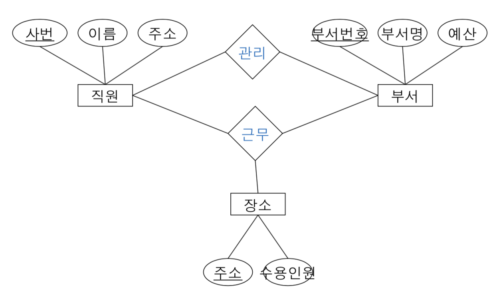
        - 여러개의 관계를 갖는다.
        - 관리 : 어느 직원이 어느 부서를 관리하는지
        - 근무 : 어느 부서의 직원이 어디서 근무한다.
    - 4.존재 종속(exstence dependency)
    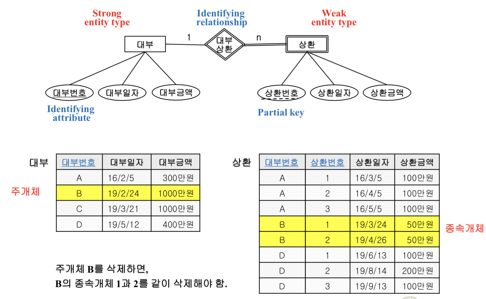
        - 대부 : 빌리는것.
        - 상환 : 값는것. 
        - 상환번호 : partial key(점선) 전체적인 부분적으로만 key의 역할을 할 수 있다는 의미.
            - 위에선 대부 번호별로 상환번호가 유니크하다.
            - 대부번호가 다른 조건에서는 유니크하지 않다.
        - 위에서 상환(주개체)은 대부(종속개체)에 종속적이다. 다이어그램에선 대부상환과, 상환을 두줄로 한다.
        - 대부를 Strong entity type, 상환을 Weak entity type, 대부상환을 Identifying relationship, 대부번호를 Identifying attribbute, 상환 번호를 partial key
        - 주 개체를 삭제하면, 종속 개체도 삭제된다.
        - 삭제 되지 않으면, 무결성이 깨진다. 테이블 간에 데이터가 달라지는 현상이 생기는 것이다.
        - 존재 종속이 아닌 경우와 비교하면서 공부하자.
       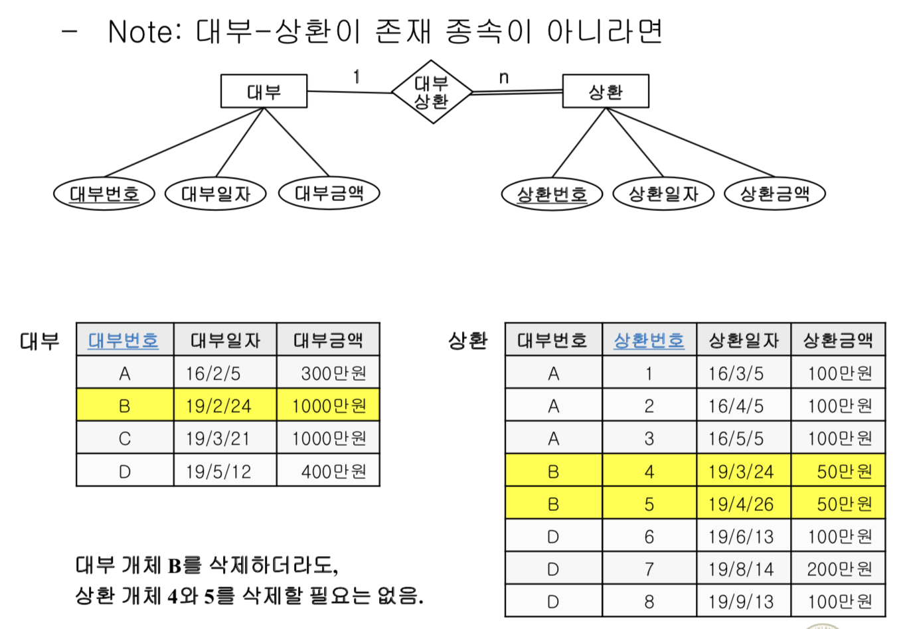
        - 밑은 무슨 상황일까 ? 
    - 5.순환적 관계(recursive relationship)
        - 한 relationship에 개의 entity가 두번 참여 하는것이다.
        - role name
        - 직원 -n 관리 -1 직원
        -    하급자   상급자
        - 더 간단하게 만들면
