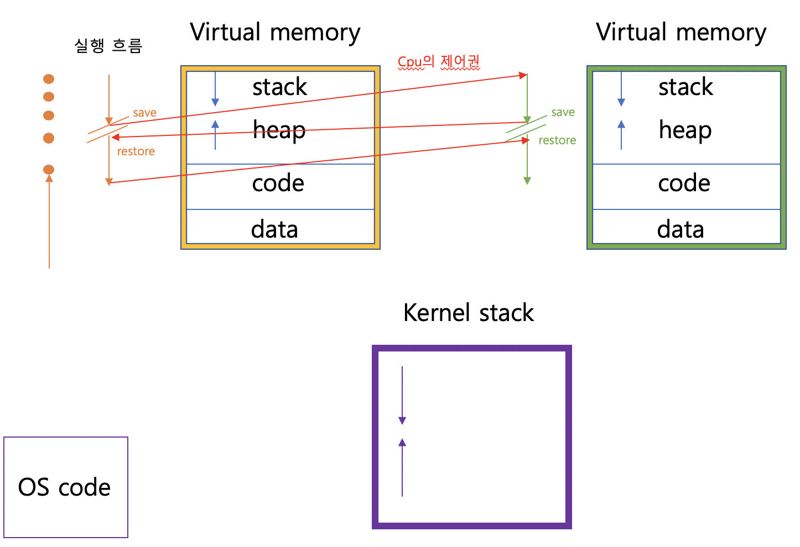
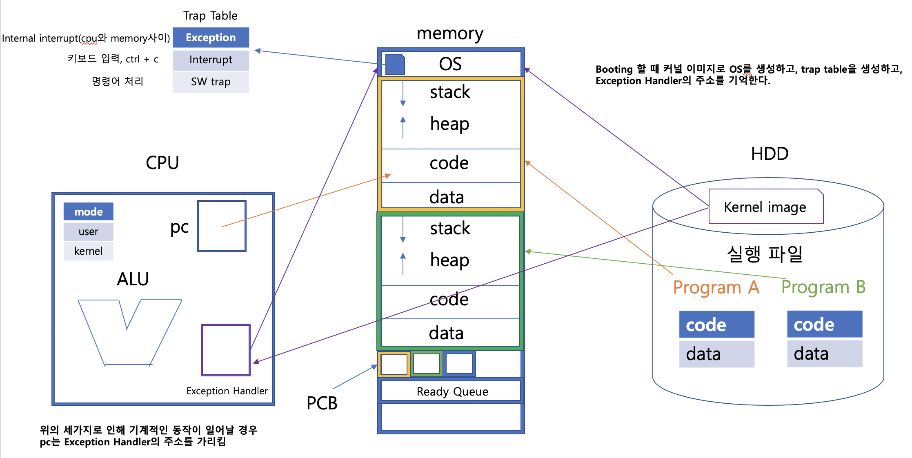
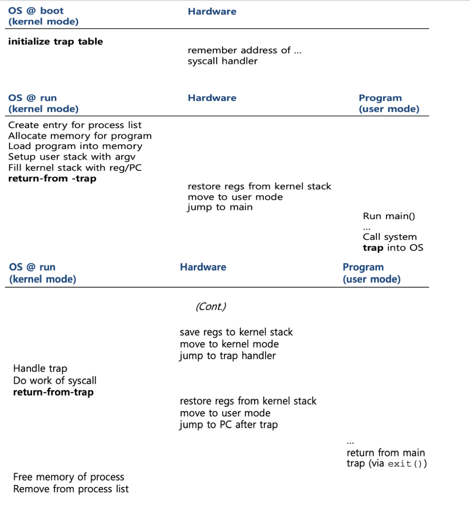
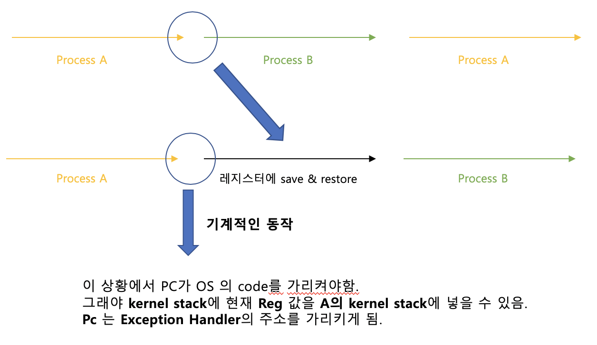
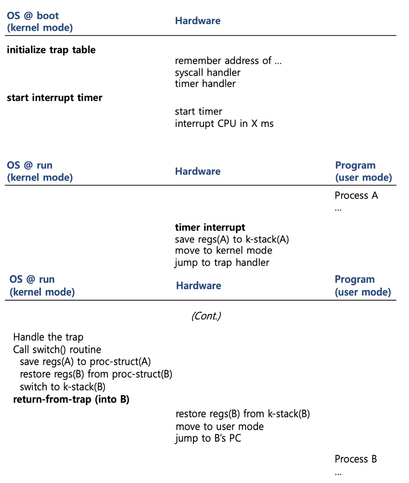

> ## 1. Kernel
>  - 커널이란 : 운영체제의 핵심이 되는 컴퓨터 프로그램의 하나로, 시스템의 모든 것을 완전히 통제한다.  

가상화된 메모리
>  
하드웨어
>  
>  이전 챕터에서 이야기 봤던 그림에 커널의 부분이 추가되었다.  
> OS는 부팅시 가장 먼저 kernel image로 부터 생성되고, 그안에서 trap table을 생성하고, cpu에 exception handler주소를 알린다.
> 가상화된 메모리에는 kernel stack이 생성되고 os의 코드가 올라간다.

> ## 2. 제한된 직접 연산에서의 직접연산이란
>  - 직접 연산이란 cpu 상에서 그냥 직접 실행 시키는 것이다.
>  - 한개의 cpu로 여러 프로세스를 처리하기 위해서 time sharing 기법을 사용한다. 
> ## 3. 제한된 연산
>  - 사용자 모드 : 확인할 수 있고 실행될 수 있는 코드가 제한된다.  

>  - 커널 모드 : 사용자 모드와 대비되는 모드로 운영체제의 중요한 코드들이 실행된다. 이 모드에서 실행되는 코드는 모든 특수한 명령어를 포함하는 모든 작업이 가능하다.

>  - 시스템콜 : 그럼 사용자 프로세스가 디스크를 읽거나 쓰는 작업은 직접적으로 불가능하다. 그러므로, 하드웨어가 제공하는 system call을 사용하여 간접적으로 요청하여 수행한다.ex) write read  함수 형태로 있지만, 실행시 실제로 커널의 코드가 실행된다.

>  - trap : 시스템 콜을 하기 위해선 프로그램은 trap이란 특수 명령어를 실행 해야된다. 이걸 이용하면kernel 안으로 분기하는 동시에  위의 cpu상에 나와있는 모드가 kernel 모드로 전환된다.

>  - return-from-trap : 커널 모드에서 운영체제가 모든 명령어를 완료하면, return-from-trap 명령어를 호출하여, kernel 모드를 다시 user모드로 전환하고, 사용자 프로그램으로 리턴한다.

>  - trap table : 컴퓨터가 부트 될때는 커널 모드에서 동작하기 때문에 하드웨어를 제어할 수 있다. 그렇기 때문에 하드웨어에 예외사건이 일어났을때 처리할 코드를 정의 하는곳. 커널이 부팅시에 만든다.

>  - trap handler : 운영체제는 명령어를 사용하여 하드웨어에 trap handler의 주소(위치)를 알려준다. 하드웨어는 이것을 기억하고 있다가, 시스템 콜과같은 예외 사건이 발생하면 하드웨어는 무엇을 해야할지 알고 있다.

> 밑의 그림은 컴퓨터가 부팅되어 프로그램을 실행 시키고 종료 될 때 까지의 변화이다.
>  
> ## 4. 협조 방식
> - 오랫동안 실행할 가능성이 있는 프로세스는 운영체제가 다른 작업을 실행할 결정을 할 수 있도록 CPU 제어권을 포기할 것이라고 가정.
> - yield System Call을 사용하여 제어권을 넘겨준다. 프로세스를 running -> ready로 전환
> - 또는 불법적인 연산(ex)0을 나눌경우)이 일어날 경우 cpu의 제어권이 넘어간다.
> ## 5. 비협조 방식
> - 무한 루프에 빠졌을때를 생각하면 된다. 그러면 운영체제는 cpu 제어권을 가져올 수 없다.
> - Timer interrupt : 위의 문제의 해결방법이다. 밀리초마다 인터럽트가 발생하고, 현재 수행중인 프로세스가 중단되며, 미리 구성된 운영체제의 interrupt handler가 실행된다.
> ## 6. 문맥의 저장과 복원
> - scheduler : 현재 실행중인 프로세스를 계속 실행할 것인지 아니면 다른 프로세스로 전환할 것인지를 결정하는 주체다.
> - context switch : 다른 프로세스로 전환하기로 결정되면 운영체제는 context switch라고 알려진 코드를 실행한다.
> - 위의 명령어는 현재 실행중인 프로세스의 레지스터 값을 커널 스택에 저장하고 실행될 프로세스의 커널 스택으로 부터 값을 복원한다.
> - 이는 어셈블리 코드를 사용하여 현재 실행중인 프로세스의 레지스터,pc,커널 스택포인터를 save하고, 실행될 것들을 restore한다.

밑의 그림을 보면서 이해해보자.
>  
> 수행중에 Exception , interrupt, SW trap으로 인해 기계적 동작을 하게 되면, pc는 Exception Handler를 가리키고, 수행한다.

밑의 그림은 timer interrupt의 동작 과정이다.
>  