# Memory Virturaliztion

## 1. 메모리 가상화란? 
- 1.메모리 가상화의 목적과 장점.
    - 목적 : OS가 각 프로세스마다 메모리를 독점하고 있다는 착각을 하게 하기 위해
    - 메모리 가상화로 인한 장점
        - 프로그래밍이 쉬워진다.(뒷단에서 많은 부분을 해결해 주기 때문에, 프로그래밍만 잘하면 됨.)
        - 메모리의 시간과 공간을 효율적이게 만듬.
        - 잘못된 프로세스가 존재하더라도, 그로 인해 전혀 영향을 받지 않음.  

- 2.과거의 메모리  
     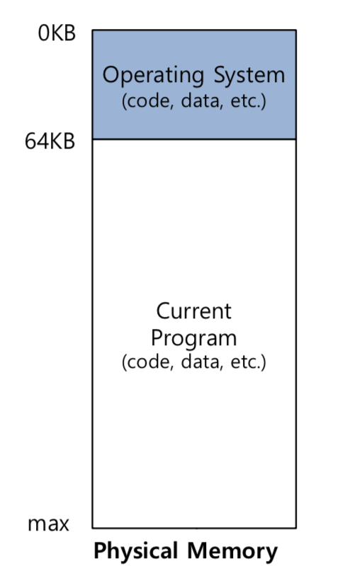
    - 굉장히 단순하였음.
- 3.멀티플 프로세스

   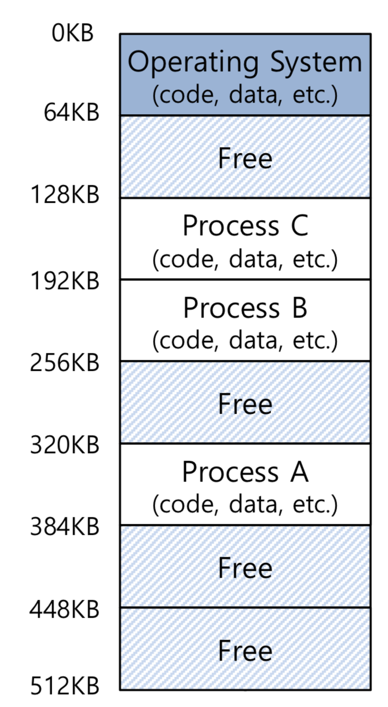
    현재는 멀티 프로세싱을 이용함.
    - 방법
        - 1.프로세스를 짧게 수행함
        - 2.한개의 cpu를 짧게 번갈아 사용함.
        - 3.위의 방법으로 효율을 높힘
    - 문제점 : protection 문제를 야기시킴.

- 4.os의 물리 주소 개념
     > 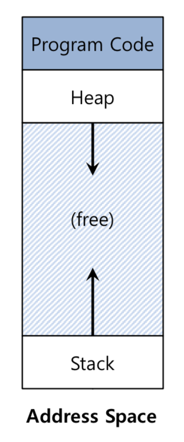
    
    - code : 프로그램 코드(instruction)가 존재함.(data영역에 있는 의존 라이브러리, 상수, 전역코드가 존재함.)
    - Heap : 동적 메모리
        - malloc
        - new
    - stack : return할 값과 주소들을 저장.
        - local variable 존재.
    
- 5.코드를 보여줌
 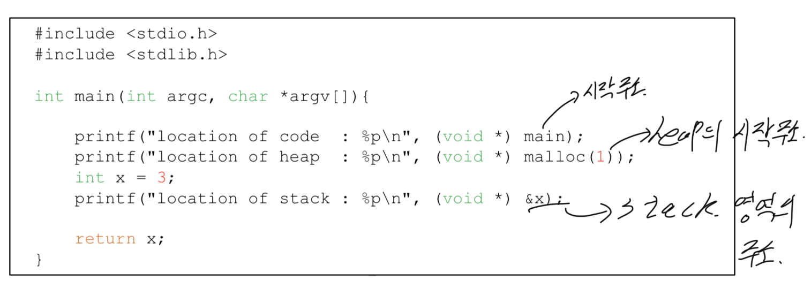
   - 결과값 설명
     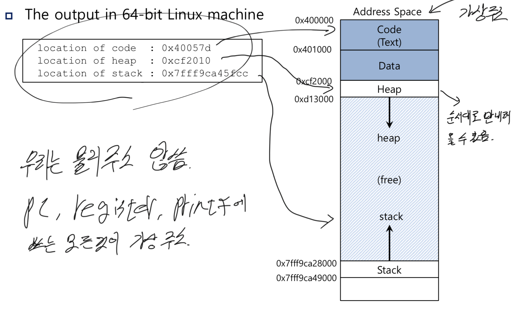
    
    

## 2. 메모리 API
- 1.malloc()
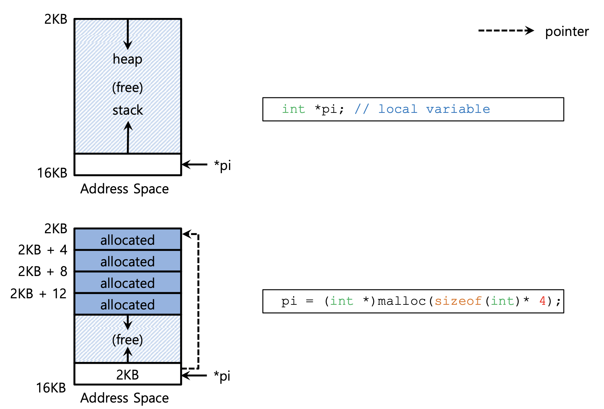
    메모리의 heap 영역에 동적으로 할당. 성공할 경우, 할당한 주소를 반환하고, 실패시 null을 반환.
   ```C void* malloc(size_t size) ```
- 2.sizeof()
    숫자를 기입하는 대신 이 함수를 사용하여 타입의 byte의 크기를 받아온다.
    - 사용법
        - int *x = malloc(10 * sizeof(int));
        - int x[10];
        - 위의 것을 printf 하면 동일한 값이 나옴.
    
- 3.free()
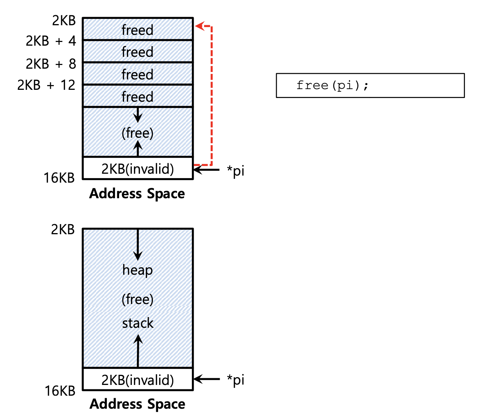
그림
    malloc으로 할당된 메모리 공간을 비워줌.
    - 사용법  
        ```C 
      void free(void* ptr)
      ```  
        - 리턴값 x

- 4.잘못 사용하는 경우
    - 1.forgetting to allocate mem
    hello는 상수로, data 영역에 존재하고, dst는 메모리를 할당하지 않아서, 복사를 할 수 없다.  


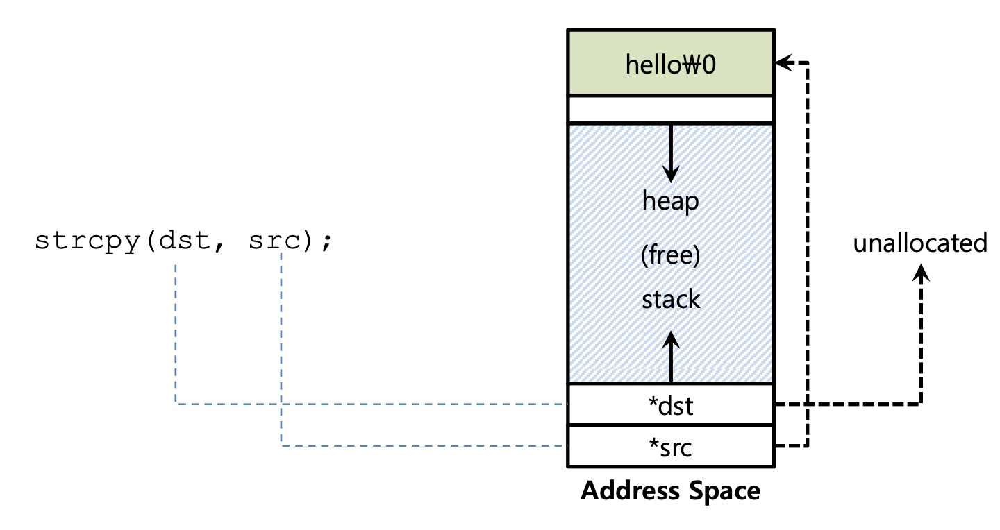
        
```C
char *src = ''hello''; //character string constatn
char * dst;            //unallocated
strcpy(dst,src);       //segfault and die
```  

 그렇기 때문에 문제를 해결하기 위해 밑의 코드와 같이 한다.
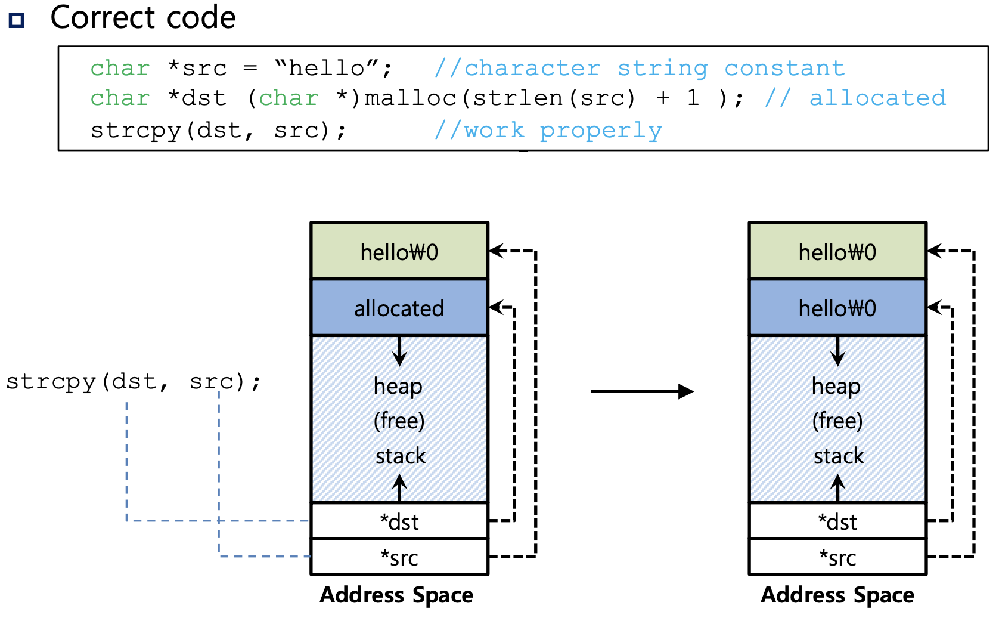

``` C  

char *src = ''hello''; //character string constatn
char * dst = (char *)malloc(strlen(src)+1);            //unallocated
strcpy(dst,src);       //segfault and die
 ```  
   
    - 2.not allocating enough mem  
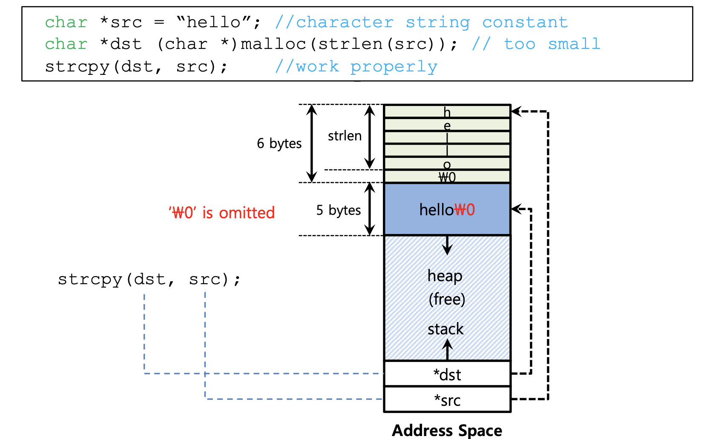  
    - 3.forgetting to init
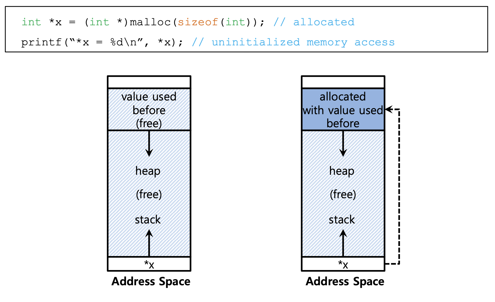  
    - 4.mem leak
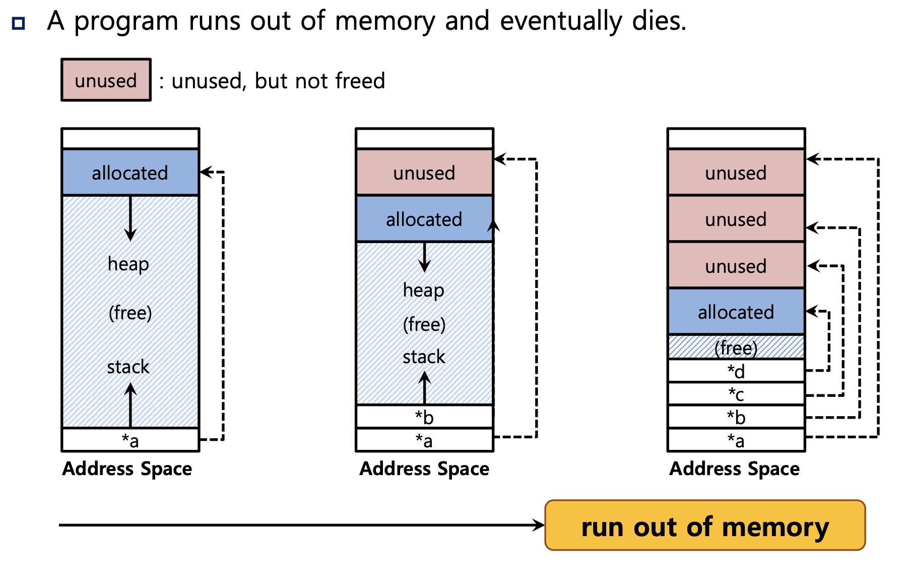  
    - 5.dangling pointer
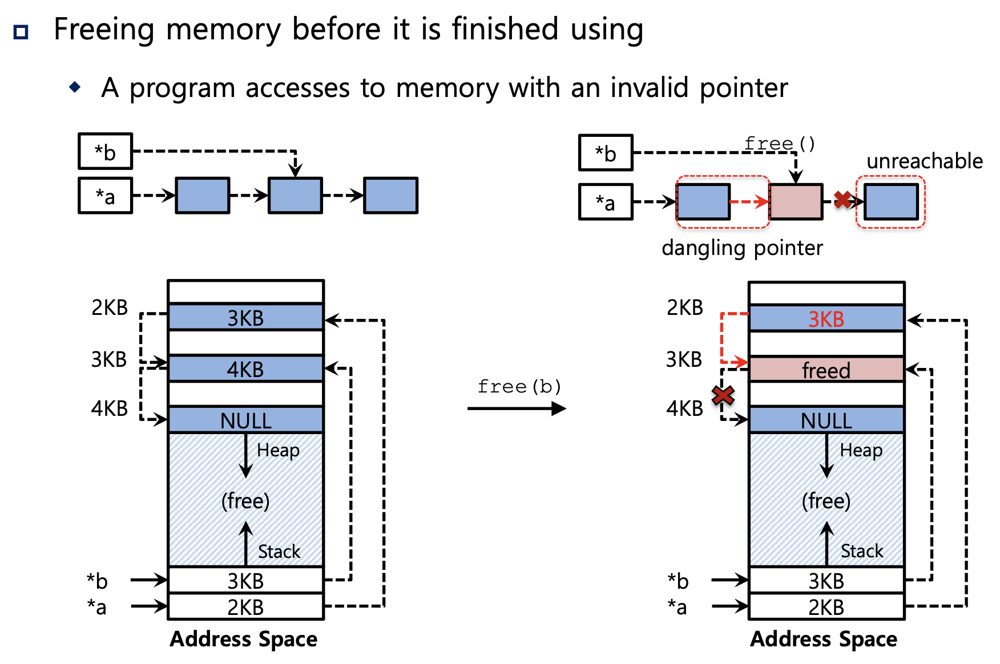  
    - 6.double free
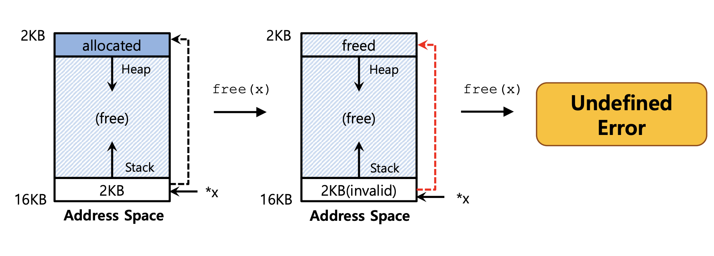  
- 5.다른 api
    - 1.realloc()
- 6.System calls
    - brk
    지정한 메모리의 크기를 벗어나게 되면 error를 반환하거나, 공간을 늘려줌.
    - mmap
    익명의 메모리 공간에 할당.
    

## 3. 주소변환(Address Translation)    
    주소 변환을 통해 하드웨어는 명령어 반입, 탑재, 저장 등의 가상 주소를 정보가 실제 존재하는 물리주소로 변환한다. 프로그램의 모든 메모리 참조를 실제 메모리 위치로 재지정하기 위해 하드웨어가 주소를 변환한다. 정확한 변환이 일어날 수 있도록 하드웨어를 셋업하기 위해 운영체제가 관여한다.  

    - 1. 실습에 들어가기 전의 가정  
        - 당분간 사용자 주소 공간은 물리 메모리에 연속적으로 배치된다.  
        - 논의를 단순화 하기 위해 주소 공간의 크기가 너무 크지 않다고 가정한다.  
        - 주소 공간은 물리 메모리 크기 보다 작다.  
    - 2. 예제  

```C
         void func()
         int x;
         x = x + 3; // this is the line of code we are interested in 
```
    위의 코드를 어셈블리어로 변경한다면.    
  
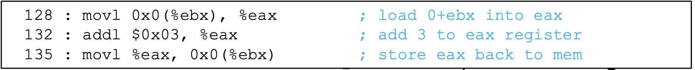  


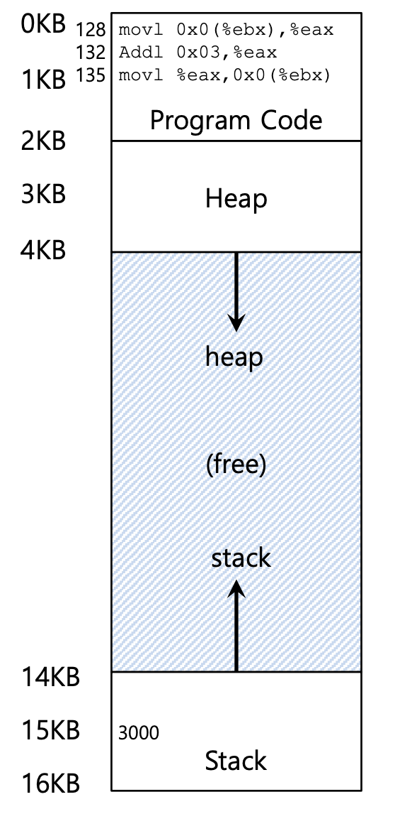   

위의 그림을 보면, 주소 공간은 0K ~ 16K 까지이다. 프로그램이 생성하는 모든 메모리 참조는 이 범위 내에 있어야 한다. 메모리를 가상화를 위해 운영체제는 프로세스 모르게 메모리를 다른 위치에 ** 재배치 ** 하려고한다!
밑의 그림은 위의 그림에서의 프로세스가 물리 메모리로 재배치 된것을 볼 수 있다.

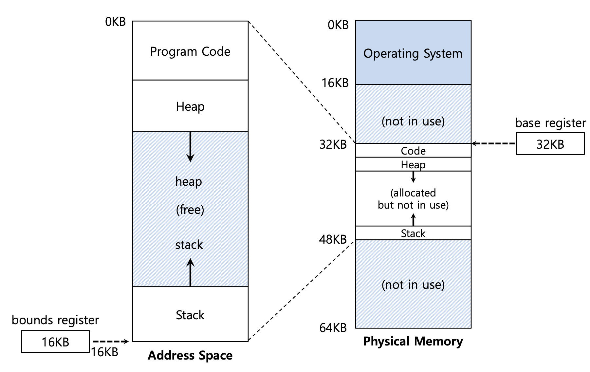   
### 3.동적 재배치.  
    동적 재배치를 공부하기 위해 두 가지의 용어를 기억하자.
    베이스 레지스터와 바운드 레지스터이다. 이 베이스와 바운드 쌍은 우리가 원하는 위치에 주소 공간을 배치할 수 있게 한다.

    이 설정에선 각 프로그램은 주소 0에 탑재되는 것처럼 작성되고 컴파일 된다.   
    프로그램 시작시, 운영체제가 프로그램이 탑재될 물리 메모리 위치를 결정하고, 베이스 레지스터를 그 주소로 지정한다. 위의 그림에 운영체제는 프로세스를 물리주소 32KB에 저장하기로 결정하면 base는 32KB가 된다. 밑은 physical adress를 구하는 식이다.

``` Physical address = virtual address + base```  

    프로세스가 생성하는 메모리 참조는 가상 주소이다. 하드웨어는 베이스 레지스터의 내용을 이 주소에 더하여 물리주소를 생성한다.

    다음은 바운드이다. 바운드의 목적은 프로세스가 생성한 모든 주소가 합법적이고 프로세스의 "범위" 안에 있다는 것을 확인하는 것이다.

    위의 그림을 보면 bound register는 16KB로 되어져 있다. 프로세스가 바운드보다 큰 가상주소 또는 음수인 가상주소를 참조하면 CPU는 예외를 발생시키고 프로세스는 종료된다.

  

    MMU(memory management unit) : 베이스와 바운드 레지스터는 CPU 칩 상에 존재하는 하드웨어의 구조이고, 주소 변환에 도움을 주는 프로세서의 일부를 메모리 관리 장치라고 한다(MMU).

    OS는 Context Switch를 할 때 멈춘 상태의 프로세스 상태를 PCB에 저정하는데 MMU 안의 base와 bound 레지스터도 같이 저장한다.

    OS는 새로운 주소 공간을 찾기 위해 free list를 사용한다. 이는 물리 메모리가 사용하지 않는 범위를 갖고 있는다.
   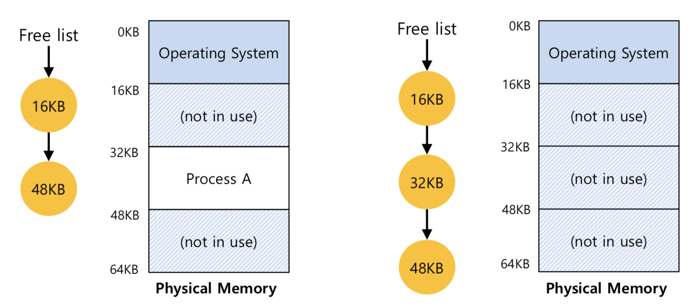 

    밑의 그림은 한 프로세스의 시작 주소값인 base와 마지막 주소값인 bound를 나타낸다.  

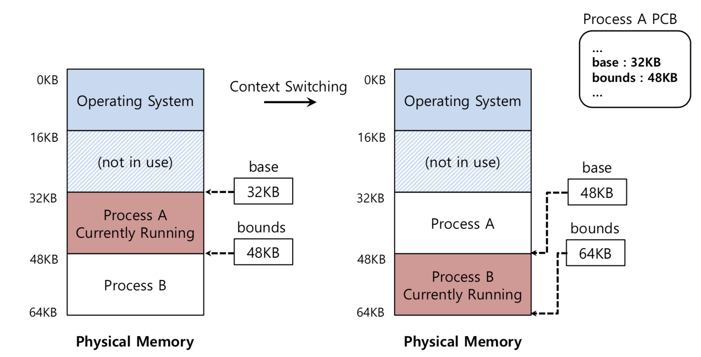 