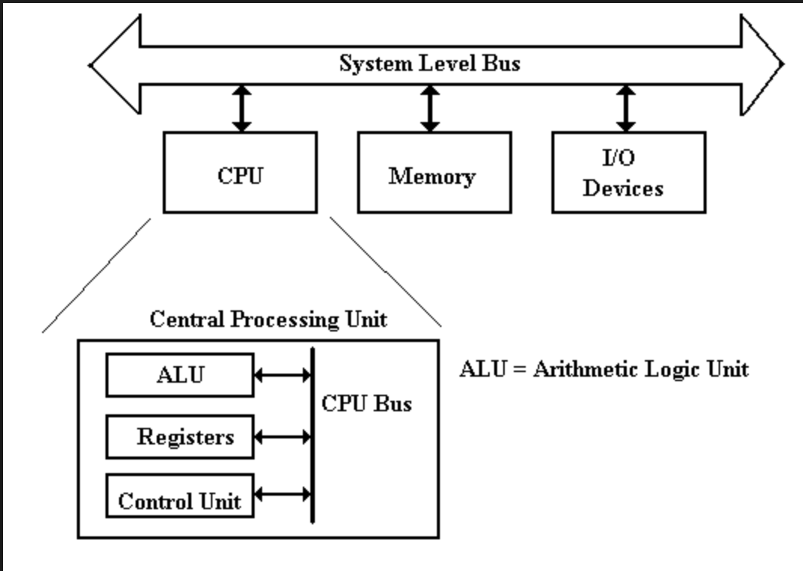
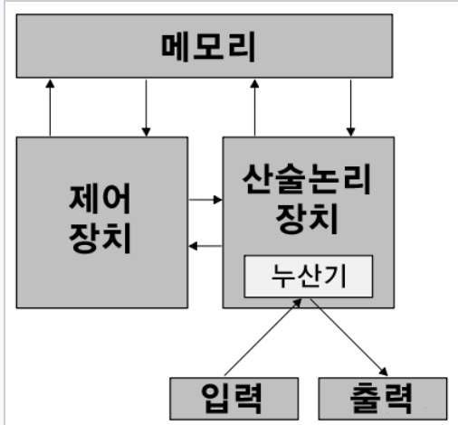
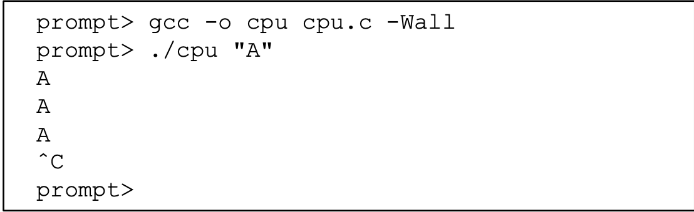
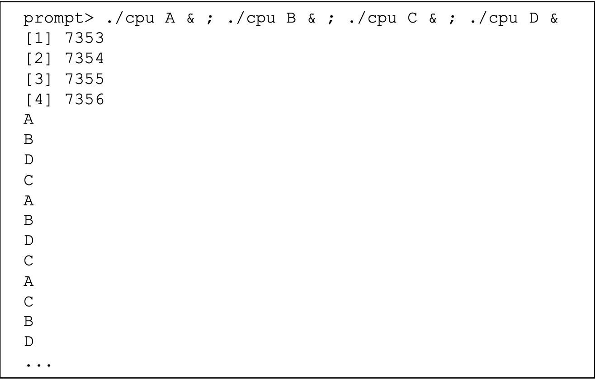
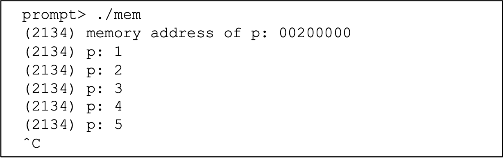
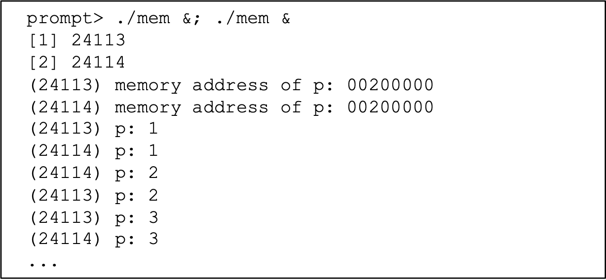
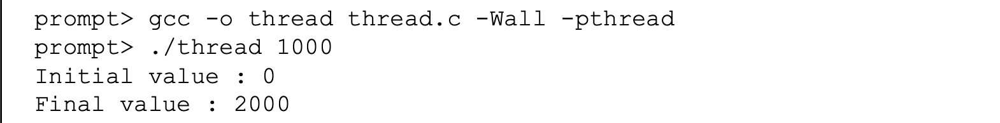
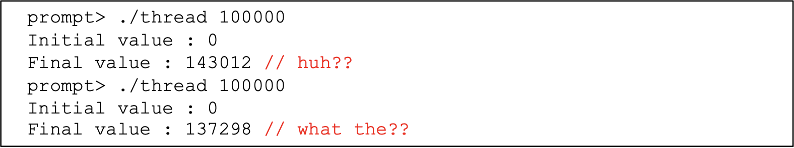

os에 대한 내용을 들어가기 전에, 알아 두면 좋을 내용들을 먼저 정리해 보려고 한다.

메모리 주소
주소란 ? 
우리가 집 주소로 사용하는 주소는 어떤 용도로 사용하는지 생각해보자. 택배 기사들은 배송을 하면서 주소를 이용한다. 내 생각에 택배 기사들에게 주소는 상품이 가야할 목적지라고 생각한다.
또 우리가 사용하는 주소는 위치를 기반이고 선형적인 체계를 가지고 있어, 주소를 통해 목적지 까지 도착할 수 있다.
cpu가 메모리에서 데이터나 명령어를 가져오려고 할 때 주소를 이용 하는 이유는 바로 주소란 목적지에 명령어와 데이터가 존재하기 때문이다.
위에서 이야기 했던 실제 주소와 같이 메모리의 주소도 위치 기반이고 선형적인 체계를 갖고 있다.

메모리의 영역에는
data : 전역 변수
stack : 지역 변수
heap : 동적 할당
세가지 영역이 존재한다.

  

그럼 어떻게 cpu는 주소가 어디에 저장되어져 있길래 메모리의 주소로 메모리에 접근할 수 있을까? 주소가 따로 저장된 것이 있는것이 아니라, bus가 목표로한 주소로 찾아가 주는것이다.

  
폰노이만 아키텍처
cpu는 연산을 하고, 연산에 필요한 데이터와 명령어를 메모리에서 가져다가 사용하는 형식.

코드를 실행 하기 위해선, hdd에 있는 코드를 메모리로 불러와서, cpu가 해당 코드를 가져다가 실행 시키는 방식
load word : cpu가 메모리로부터 데이터를 가져옴.
srote word : cpu가 메모리에 데이터를 저장.

전역변수
파일 안에 선언된 변수들 뿐만 아니라, 라이브러리 또는 오브젝트에 있는 모든 변수들을 전역 변수라고 한다.
이 변수는 data 영역에 저장된다.

지역변수 : 함수 내에 있는 함수로, stack에 저장된다.

동적할당(dynamic) : 실행중(main이 실행된 후에) 발생된 것으로 heap 영역에 저장된다.

main 함수 실행 직전이란, 전역변수를 올리고, 함수를 올린수 main함수를 실행하기 직전을 의미한다.


프로그램이 실행될때 일어나는 일 : 명령어 실행
프로그램이 실행 된다는 것은, 
1.fetch : 프로세서가 메모리로 부터 명령어를 읽어오고
2.decode : 무슨 명령어 인지 파악 하고
3.execute : 실행 시킨다.(즉 두 수를 더하고, 메모리에 접근하고, 조건을 검사하고, 함수로 분기하는 등의 정해진 일을 한다.)


운영체제의 책임
1. 프로그램을 쉽게 실행 시킨다.(여러개의 프로그램을 시키는 것을 이야기 하는데 concurency를 의미하는 듯하다.)
2. 프로그램간 메모리 공유 
3. 다른 장치와 상호 작용 가능케

종합해 보면 운영체제란 ? 
주어진 자원을 효율 적이고,공정하게 배분 하여 시스템을 사용하기 편리하면서 정확하고 올바르게 동작 시켜주는 소프트웨어이다.

운영체제는 가상화(virtualization)을 사용하여 프로세서, 메모리, 디스크와 같은 physical recource를 이용하여 일반적이고, 강력하고, 사용이 편리한 형태의 자원을 생성한다.

ex) 많은 프로그램이 cpu를 공유하여 동시에 실행 될 수 있도록 하고
    많은 프로그램이 강력하고 사용이 편리한 가상 형태의 자원을 생성하고
    많은 프로그램이 디스크 등의 장치를 공유 할 수 있게 한다.

그래서 때로는 virtual machine이라고도 불린다.

# 1.Virtualization(가상화)  

## **1.CPU Virtualization(CPU 가상화)**
원래 1개의 프로세서는 1개의 프로그램를 실행 할 수 있다.

밑의 코드는 한개의 프로그램을 실행하는 코드이다.
```C  
 #include <stdio.h>
 #include <stdlib.h>
 #include <sys/time.h>
 #include <assert.h>
 #include "common.h"

 int main(int argc, char *argv[])
 {
   if (argc != 2) {
    fprintf(stderr, "usage: cpu <string>\n");
    exit(1);
  }
    char *str = argv[1];
    while (1) {
    Spin(1); // Repeatedly checks the time and
    returns once it has run for a second
    printf("%s\n", str);
    }
    return 0;
 }
```

한개의 프로세스를 실행 시킨 결과값은 밑과 같이 단순할 것이다.


하지만 여러개의 프로세스를 동시에 실행 시키면 하나의 프로세서 밖에 없음에도 여러개의 프로그램을 실행 시키는것을 볼 수 있다.


위와 같이 할 수 있게 하는 것은 운영 체제가 시스템에 매우 많은 수의 가상 CPU가 존재하는 듯한 환상(illusion)을 만들어 내기 때문이다.
그래서 한개 또는 소규모의 cpu 집합을 무한개의 CPU가 존재하는 것 처럼 변환하여 동시에 많은 수의 프로그램을 실행 시키는 것을 CPU 가상화라고 한다.

위와 같이 특정 순간에 여러개의 프로그램이 실행될 때 우선순위를 정하는 것을 **policy(정책)** 이라고 한다.
또 운영체제가 구현한 동시 다수의 프로그램을 실행 시키는 기본적인 기법을 **mechanism**이라고 한다.

## **2.메모리 가상화.**
physical memory 모델은 매우 단순하다. 바이트 배열로 이루어져 있다.
따라서 메모리에 접근 하기 위해선 Address가 필요하다.
프로세서가 사용할 명령어들은 역시 메모리에 존재한다.
밑의 코드를 보자.
```C 
#include <unistd.h>
#include <stdio.h>
#include <stdlib.h>
#include "common.h"

int main(int argc, char *argv[])
{
    int *p = malloc(sizeof(int)); // a1: allocate some
                                      memory
    assert(p != NULL);
    printf("(%d) address of p: %08x\n",
       getpid(), (unsigned) p); // a2: print out the
                                    address of the memmory
    *p = 0; // a3: put zero into the first slot of the memory
    while (1) {
        Spin(1);
        *p = *p + 1;
        printf("(%d) p: %d\n", getpid(), *p); // a4
    }
  return 0;
}
```
a1 에서 지역변수이자 포인터 변수 p는 stack에 올라가고 포인터(주소)를 담는다. 포인터가 가르키는 곳은 int 의 크기인 4byte로 heap에 올라간다.
a2 는 프로세스 아이디를 프린트하고, 포인터 변수 p의 주소를 프린트한다.
a3 는 루프로 들어가 1초 대기 후 p가 가리키는 주소에 저장되어 있는 값을 1 증가 시키고 프린트 한다.


  
위의 결과와 같이 한개의 프로그램을 실행 시켰을 때는 문제가 이상할게 없어 보인다.

  
하지만 여러개의 프로그램을 실행 시켰을 때, 서로 다른 프로세스 id로 구분 되지만, p는 동일한 메모리 주소를 사용하고 있다.
이것을 보면 같은 메모리 주소를 공유하고 있나 생각이 들지만, 결과 값은 서로 다른 메모리를 가지고 있는것 처럼 보인다. 결과값을 보면 서로 다르게 실행한 동일한 프로그램에서 p의 변수값의 주소가 동일하게 나온다.
이러한 결과가 나오는 이유는 운영체제가 **virtualizing memory(메모리 가상화)를 하기 때문이다.
각 프로세스는 자신만의 가상 주소 공간(virtual address space) 를 갖고, 운영체제는 이 가상 주소 공간을 컴퓨터의 물리 메모리로 mapping 한다.
그렇기 때문에 실행 중인 프로그램의 입장에서는 자기 자신만의 물리 메모리를 갖는 셈이다.


# 2.Concurrency(병행성)
병행성이란 프로그램이 한번에 많은 일을 할 때(동시에) 발생하는 그리고 반드시 해결해야 하는 문제들을 가리킬 때 이 용어를 사용한다.
가상화를 사용하면 운영체제는 한 프로세스 실행, 다음 프로세스 실행, 또 다음 프로세스 실행 등의 순서로 여러 프로세스를 한번에 처리한다.
이런 처리는 많은 문제들을 발생 시킨다.
운영체제 뿐만 아니라 멀티 쓰레드 프로그램도 동일한 문제를 갖고 있으니 밑의 코드를 확인해 보자.


```C 
#include <stdio.h>
#include <stdlib.h>
#include "common.h"

volatile  int counter = 0;
          int loops;

    void *worker(void *arg) {
        int i;
        for (i = 0; i < loops; i++) {
            counter++;
            }
         return NULL;
        }
    int main(int argc, char *argv[])
    {
        if (argc != 2) {
            fprintf(stderr, "usage: threads <value>\n");
            exit(1);
      }
    loops = atoi(argv[1]);
    pthread_t p1, p2;
    printf("Initial value : %d\n", counter);

    Pthread_create(&p1, NULL, worker, NULL);
    Pthread_create(&p2, NULL, worker, NULL);
    Pthread_join(p1, NULL);
    Pthread_join(p2, NULL);
    printf("Final value : %d\n", counter);
    return 0;
}
```
volatile는 변수를 메모리에 한정 하겠다는 의미이다.
위의 코드에서 worker란 함수는 인자값으로 받은 정수가 될 때 까지 counter를 계속해서 1을 증가시키는 함수이다.
그 밑의 코드에선 p1, p2 쓰레드를 생성하여 worker 함수를 실행 시키려고한다. 여기서 worker에서 증가 시키는 counter 변수는
두 스레드가 공유하는 변수이다. 
생성을 한 후에, join을 사용하여 끝날 때 까지 기다렸다가 counter 변수를 찍어보자.
먼저 인자값 1000을 넣었을때 결과값을 보자.

  
위의 결과값을 봤을 때 결국 마지막 final로 찍히는 counter변수의 값은 2000 찍힌다.

하지만 10만개를 넣었을때의 결과값을 보자.
  
우리가 예상했던 20만의 값이 찍히지 않는 현상을볼 수 있다. 이유가 뭘까?

위의 문제점에 대해서 이야기해 보자.
worker 함수의 루프안에 counter 변수를 1 증가시키는 부분을 프로세스 관점에서 생각해 보자.
volatile 함수로 인해 counter가 메모리에 저장된다는 특성이 있다.
counter 변수에 1을 증가시키기 위해 프로세스는 3개의 명령어를 사용한다.   
1. 프로세스는 메모리로 부터 counter 변수를 lw 한다.  
2. 프로세스는 counter 변수에 1을 더한다.  
3. 프로세스는 메모리에 counter+1한 상태를 쓴다.  
이 세 개의 명령어가 atomical 하지 않기 때문에 이러한 현상이 발생하는 것이다.  
하나의 프로세서로 여러개의 프로그램을 수행하기 위해 timeshare로 시간 별로 프로그램을 수행한다.
만약에 프로세서가 p1 스레드를 1,2까지 하고 포커스를 p2로 가져가게 되면, 메모리에 변경된 counter의 값을 쓰지 못하는 상황이 온다.
이러한 문제로 인해 위의 결과가 나오는 것이다.


# 3.Persistence(영속성)
DRAM 과 같은 장치는 valtile(휘발성)방식으로 저장하기 때문에 전원이 꺼지거나 고징이 나면 메모리의 데이터는 쉽게 손실될 수 있다.
그렇기 때문에 데이터를 영속적으로 저장할 수 있는 하드웨어와 소프트웨어가 필요하다.
위의 하드웨어로는 HDD 와 SDD가 있다.
위의 디스크를 관리하는 운영체제를 파일 시스템(file system)이라고 부른다. 이 것은 사용자가 생성한 file을 시스템의 디스크에 안전하고 효율적인 방식으로 저장하는 역할을 한다.

밑의 코드를 보자.
```C 
 #include <stdio.h>
 #include <unistd.h>
 #include <assert.h>
 #include <fcntl.h>
 #include <sys/types.h>

 int main(int argc, char *argv[])
 {
      int fd = open("/tmp/file", O_WRONLY | O_CREAT | O_TRUNC, S_IRWXU);
      assert(fd > -1);
      int rc = write(fd, "hello world\n", 13);
      assert(rc == 13);
      close(fd);
      return 0;
 }
```
위의 코드에서 총 3번의 운영체제를 호출한다.  
1.open()에서 파일을 생성하고 연다.  
2.write()에서 파일에 데이터를 쓰고  
3.close()에서 파일을 닫고, 프로그램이 더이상 해당 파일을 사용하지 않는다고 알린다.  
위의 system call은 운영체제에서 file system이란 부분으로 전달된다.  
위에서 보면 간단해 보이지만 데이터를 디스크에 쓰기 위해서 파일 시스템은 많은 작업을 한다.  
1. 새 데이터가 어디에 저장될지 결정하고  
2. 파일 시스템이 관리하는 다양한 자료구조를 통해 데이터의 상태를 추적한다.  
3. 이러한 작업을 하기 위해선 저장 장치로부터, 기존 자료 구조를 읽거나 갱신해야한다.  
  
위의 내용을 정리해 보려고 한다.  
운영체제는 cpu, memory, disk같은 물리 자원을 가상화 하고,  
 병행성과 관련된 복잡한 문제를 처리한다.   
 또 파일을 영속적으로 저장하여 오랜 시간동안 안전한 상태에 있게 해야 한다.  
 이러한 시스템을 구현하기 설계 목표가 있다.  
 1. abstraction(개념)
    위의 시스템 콜처럼 아주 쉬운 작은 부분들로 나누어 구현 할 수 있도록 해야한다.
 2. performance(성능)
    오버헤드를 최소화 하는 것이다. 가상화와 사용하기 쉬운 시스템을 만드는것은 의미가 있지만 해야만 하는것은 아니다.
    이러한 기능들을 오버헤드 없이 구현해야한다.
 3. protection(보호)
    운영체제는 한 프로그램의 악의 또는 의도치 않은 행위가 다른 프로그램에 피해를 주지 않아야 한다.
    보호는 운영체제의 원칙중 하나인 isolation 원칙의 핵심이다. 
 4. reliable(신뢰성)
    운영체제는 계속 실행 되야하고, 그위에서 실행되는 프로그램도 잘 작동시켜야 하므로 높은 신뢰성이 필요하다.