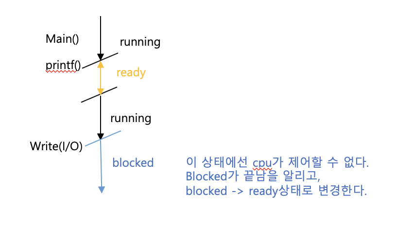

# Process  

## virtualization(가상화)  
>목적 : 착각 시키는것.
> - cpu를 독점 해서 사용하는것 처럼 착각 하게  
> - memory는 모든 메모리를 한개의 프로그램이 독점해서 사용하게 착각 하게 하는것.  
> ## **우리가 프로그램을 쉽게 실행 시킬 수 있도록 도와줌.**  


### 알아두기 
- 우리가 사용하는 vm 웨어는 그냥 운영체제에 이뮬레이터를 올려서 또다른 os를 만드는 것임

## 그렇다면 과거에는 지금 보다 성능이 떨어지는 컴퓨터로 어떻게 가상화를 했을까 ? 컴퓨터가 좋지 않음에도 불구하고 ?  
> **TimeSharing**기법을 사용하여 가능하게 했다.   


> TimeSharing이란 ?   
제어권을 **시간**에 따라 다른 프로그램으로 제어권을 넘겨 주는 것이다.

## **프로세스**란 실행되는 프로그램을 의미한다.
프로세스가 어떻게 구성되는지 알기 위해서 밑의 그림을 보자.


> 폰노이만 아키텍처를 기반으로, 컴퓨터의 처리는 cpu가 메모리로 부터 데이터를 읽어와 수행하는 방식으로 진행된다.

> 추가적으로 보조기억장치 hdd에 A프로그램과 B프로그램을 프로그래밍 언어로 구성하여 컴파일해서 얻은 실행 파일이 저장되어져 있다.   
> 그리고 각 실행 파일엔 code,data(전역변수, 상수 존재)가 존재한다.

>프로그램이 실행 되기 위해서,  
> 1. 메모리는 해당 실행 파일을 메모리로 가져와 stack, heap, code, data 영역을 초기화 한다.  
> 2. 그 이후, cpu의 pc는 code에 저장된 main함수의 주소를 가리키고, 주소가 가리키는 각각의 명령어가 실행되면서 프로세스가 만들어진다.

- 알아두기 ! 
loading은 실행파일을 메모리로 읽어오는것.
기계어 load word랑 구분 할 수 있어야한다.

- 알아두기 ! 프로그램 실행 흐름은 자료구조 스택이 이용된다. main 함수가 먼저 실행 되고, 그안에서 함수가 실행된다면, 스택에 그 함수가 쌓이게 되는 방식이다.


**프로세스란 착각으로 인해 생성된 주체이다.**  
밑의 그림은 가상화 메모리와 가상화 cpu를 사용하여 두개의 프로그램을 2개의 프로세스로 만든 내용이다.


>위의 그림에서 **빨간선**의 프로세스의 흐름을 보면 cpu의 제어권이 이동하는 것을 볼 수 있다. 한개의 cpu는 timesharing 기법을 사용하여 여러개의 프로그램을 동시에 수행하는 것 처럼 보여준다. 그래서 왼쪽 실행흐름은 중간에 멈추고, 오른쪽의 프로세스가 실행된다.  이것을 사람이 인지하지 못하는 속도로 빠르게 수행하여, 동시에 처리하는 것 처럼 보이게 하는것이다.

> 추가로, 모든 I/O 들은 파일로 추상화 되어 실행 흐름(점)으로 존재한다. 대부분의 장치 I/O들은 이와 같이 file처럼 추상화 되어 사용되어지고 있다.

>Protection : 한개의 프로그램이 다른 프로그램에 영향을 끼치지 못하게 하는것을 의미한다.
ex) A의 프로그램에서 오류가 나더라고 B의 프로그램은 문제 없이 실행 되어져야 한다.

>여기서 몇가지 질문이 생긴다.  
> 1. 그럼 실행 흐름이 중간에 끊겼다가 다시 시작되는데, 이전에 수행된 흐름들을 저장해야 되나 ?
> 2. 한개의 cpu는 현재 실행할 데이터를 가지고 있어야 하는데 이전에 수행되다가 잠시 멈춰 있는 데이터는 어떻게 저장해야되나? 

>먼저 1번 질문에 대해서 이야기해보자.    
>저장하지 않는다. 현재의 프로세스의 mips(million instruction per second)는 약 백만개이다. 하지만, 이들을 모두 저장할 이유도 없고, 너무 많아서 저장할 수도 없다.

>다음은 2번 질문에 대한 답이다.
cpu는 현재 수행중인 프로세스의 데이터를 레지스터에 놓고 사용중이기 때문에, 이전에 잠시 멈춰둔 데이터와 수행했는지와 상태를 저장해 놔야한다.
이들을 저장하는 공간은 바로 메모리 안에 존재하는 **(PCB)Process Control Block**
라는 배열에 저장한다.  

>그리고 다시 멈추었던 프로세스를 시작하기 위해서, 지금까지 수행중이던 프로세스를 PCB해당 프로세스의 PCB에 저장해 놓고, 멈춘 이전의 프로세스 데이터를 해당 PCB로 부터 읽어와 수행한다.  여기서 register에서 cpu로 저장하는 것을 **save** 라 하고, 가져오는 것을 **restore**라고 한다.

### 알아두기!
-  레지스터에서 중요한 것은 PC와 Stack Pointer이다.
- 메모리에서 중요한 것은 Instructions , Data section


## OS의 API

- Create : 프로그램을 수행하기 위해 새로운 프로세스를 생성
- Destroy : 종료된 프로세스를 제거
- wait : process를 기다림.
- Miscellaneous Control 
- Status : process의 상태 보기


## 프로세스의 상태
> - running : 가상 cpu와 물리 cpu가 결합해서 점을 찍을떄를 의미한다.
> - ready : cpu가 붙기만 하면 실행이 가능한 상태
> - Blocked : 끊겼는데, cpu를 줘도 할일이 없는 상태.(조건이 해결되기 전까지 막혀있어야 되는 상태 이것은 I/O를 요청할떄 )
> 이것 이외에도 몇개 더 있지만 이들이 핵심적인 상태이다.

> 그럼 운영체제는 어떻게 실행 중인 프로세스를 중지하고, 다른 프로세스를 수행할까?   **멈추는 것은 코드 내에 존재하지 않는다.** 
 timesharing 으로 일정 시간 되면 intterup을 걸어서 프로세스를 교체한다.
외부의 요인에 의해서 끊긴다.




## Ready Queue    
>cpu가 프로세스를 실행하기 위해선 해당 프로세스가 ready 상태여야만 한다. 그렇기 때문에, ready Queue에 들어온 순서대로 하나씩 수행된다.
하지만 이 순서를 먼저온것을 수행해줄 것인지 또는 우선순위로 수행해줄 것인지는 policy에 따라 정해진다.

>위에서 block 처리된 프로세스는 blocked 종료 됨을 알리고, ready Queue로 올린다.  

>만약에 장치로 인한 block 이라면?  
ex) 하드디스크(모니터)에 입출력으로 인해 블록되면, 하드디스크(모니터) 각 기다리는 사건에 가서 줄을 서야한다.
그러면 빼서 ready Queue로 옮겨주는것이다.

요청한 io가 끊나는 사건을 처리하는 곳 가서 기다리면 된다.


이때 운영체제가 관리하는 것은 프로세스의 리스트를 관리하는 것이다.

PCB(process control block) : 프로세스의 상태와, 레지스터의 데이터를 저장. 이것들을 컨텍스트라 함.
컨텍스트가 교환되는데 그걸 문맥교환 (**Context Switch**)이라 한다.

## 컨텍스트의 구조는 구조체로 만든다. 

```C 
struct context {
int eip; // Index pointer register
int esp; // Stack pointer register
int ebx; // Called the base register
int ecx; // Called the counter register
int edx; // Called the data register
int esi; // Source index register
int edi; // Destination index register
int ebp; // Stack base pointer register
};
// the different states a process can be in
enum proc_state { UNUSED, EMBRYO, SLEEPING,
RUNNABLE, RUNNING, ZOMBIE }; // runnable : ready , sleeping : block

```  
- 객체지향 언어로 만들고 싶다면 클래스로 하면된다. 
  
## 밑의 구조체는 **process**이다.
```C 
// the information xv6 tracks about each process
// including its register context and state
struct proc {
char *mem; // Start of process memory
uint sz; // Size of process memory
char *kstack; // Bottom of kernel stack
// for this process
enum proc_state state; // Process state 상태
int pid; // Process ID 프로세스 아이디
struct proc *parent; // Parent process //부모 프로세스
void *chan; // If non-zero, sleeping on chan
int killed; // If non-zero, have been killed
struct file *ofile[NOFILE]; // Open files
struct inode *cwd; // Current directory
struct context context; // Switch here to run process 컨텍스트
struct trapframe *tf; // Trap frame for the
// current interrupt
};
```
