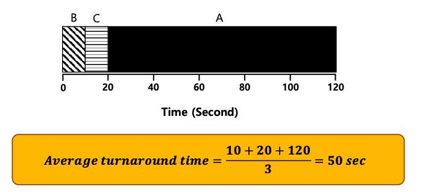
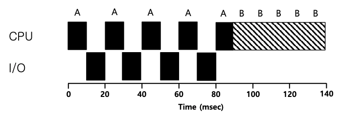
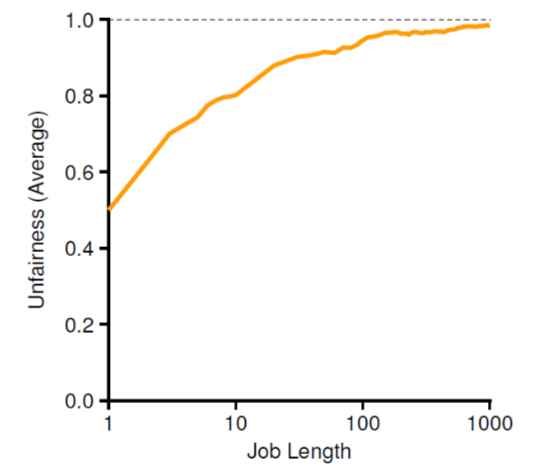
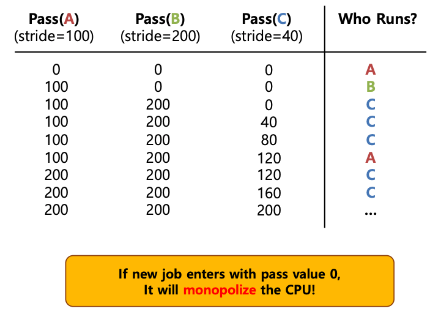

# Scheduling

## 1.Scheduling 이란 ?  
 
운영체제가, 가상화(병행성 등의 문제를 해결)를 하기 위해서 일정한 기준에 의거하여 여러 프로세스들에게 cpu의 제어권을 할당하는 것.

## 2. Scheduling을 공부하기 위해서 특정 상황을 가정해 보자.
  
- 1. 모든 작업은 같은 시간동안 실행된다.
- 2. 모든 작업은 동시에 도착한다.
- 3. 각 작업은 시작되면 완료될 때까지 실행된다.
- 4. 모든 작업은 CPU만 사용한다.(I/I를 사용하지 않음을 의미한다.)
- 5. 각 작업의 실행 시간은 사전에 알려져 있다.  
  
위의 조건들은 실제에서는 전혀 불가능한 상황임을 알아둬야한다. 위의 가정들은 scheduling을 더 쉽게 이해하기 위한 조건들이다.

## 3. scheduling의 평가 항목.  

- 1. turnaround time(반환 시간) : 작업이 완료된 시간에서 작업이 시스템에 도착한 시각을 뺀 시간.
- 2. fariness(공정성) : **성능과 공저성은 성능 측면에서 서로 상충되는 목표이다**.스케줄러는 성능을 극대화 하기 위해 몇몇 작업 실행을 중지하며 결과적으로 악화된다.
- 3. response time(응답 시간) : 작업이 도착할 때부터 처음 스케줄 될 때까지의 시간.

## 4. 스케줄링 기법(turnarround time)

- 1. FIFO(First In First Out) : 먼저 들어간 작업은 먼저 실행된다.
    - 특징
        - 간단하고, 구현하기 쉽다.
    - 1. 예제 1.
        - A,B,C가 동시에 실행 되지만, 어떻게 되다보니 A,B,C 순서대로 실행 되었다고 가정하자.
        - 각 프로그램이 10초 동안 실행된다.
        -  
        - 밑은 정의한 반환 시간을 나타낸다.
    - 2. 예제 2.
        - 이곳에선 위에서 말한 1번(모든 작업은 같은 시간동안 실행된다.) 가정을 제외해 보자.
        - A,B,C가 동시에 실행 되지만, 어떻게 되다보니 A,B,C 순서대로 실행 되었다고 가정하자.
        - A가 100초 동안 실행된 후에 B와 C가 10초씩 실행된다.
        -  
        - 위와 같은 상황에서의 반환시간은 효율적이지 않다.


- 2. SJF(Shotest Job First) : 최단 작업 우선으로 가장 짧은 실행 시간을 가진 작업을 먼저 실행 시킨다.
    - 예제 1.
        - 특징 : Non-preemptive scheduler(비선점) : 실행된건 종료가 되야 다른 프로그램을 실행할 수 있다.
        - B와 C가 실행된 이후 A가 실행된다.
        - A는 100초 실행하고, B와 C는 10초씩 실행된다.
        -  
        - 평균 반환 시간이 짧아진 것을 볼 수 있다.

    - 예제 2.
        - 모든 작업이 동시에 동작한다는 가정을 제외하고 생각해보자.
        - A는 t = 0일때 도착하고, 100초 동안 실행된다.
        - B와 C는 t =10일때 도착하고 각각 10초 동안 실행된다.
        -  
        - 위와 같은 상황에선 프로그램이 종료된 후에 실행 해야 되기 때문에 평균이 시간이 길어진다.
- 3. STCF(Shortest Time-to-Completion First)
    - 예제 1.
        - 위와 같은 문제를 해결하기 위해서 Preemptive 방식(cpu가 실행중인 프로그램을 멈추고 다른 프로그램을 실행 시킬 수 있다.)을 사용해보자.
         -  
        - A가 먼저 실행되지만, SJF 기법 특성상 B와 C의 남은 작업 시간이 A보다 짧기 때문에 10초 이후로는 B가 실행되고, 그 이후 짧은것을 실행하면 C가 실행되고, A가 실행된다.

## 4. response time(응답시간)과 스케줄링 기법.
 
위에서는 반환 시간이란 평가 기준을 사용했다면, 이번에는 응답 시간을 평가 기준으로 사용하려고 한다.  
위에서 이야기한 기법으로 응답 시간을 측정한다면, 매우 좋지 않게 나온다.
- 1. Round Robin(RR) :  위의 응답 시간 문제를 해결하기 위해 나온 기법이다.
    - 특징.
        - 작업이 끝날때 까지 기다리지 않는다.
        - 대신 일정 시간 동안 실행한 후 실행 큐의 다음 작업으로 전환한다.
        - ** 이때 작업이 실행되는 일정 시간을 타임 ```슬라이스```라고 한다. **
    - 예제.
        -  
        - RR의 평균 응답시간은 위와 같이 1이 나오고, SJF의 평균 응답 시간은 5이다.
        - 응답 시간은 줋일 수 있지만, 반대로 반환시간이 길어진다.
        - 타임 슬라이스의 길이는 짧을 수록 RR의 성능이 좋아 지지만, 너무 짧으면, 문맥 교환 비용이 전체 성능에 영향을 미친다.
            - context switching에서 cpu의 cache를 새로 불러와야 하기 때문에 빈도수가 많아지면 문제가 된다.

## 5. Incorporating I/O  
위의 3번째 가정을 제외해 보자. 모든 I/O가 가능하다.  
프로세스 안에서 입출력 작업을 요청시 해당 cpu의 상태는 blocked 되고 cpu는 하는 일이 없어진다.  

- 1. 예제 1.
    - 프로그램 A,B 각 50msec의 cpu시간이 필요하다.
    - A는 10msec 실행 후, 10msec 동안 입출력을 실행한다.
    - B는 입출력을 실행하지 않고, A를 먼저 실행시킨 후 B를 실행시킨다.
    -  
    - 위의 그림은 자원의 비효율적인 활용을 보여준다.
  
- 2. 예제 2.
    -  
    - 위의 그림은 I/O로 CPU가 쉬는 시간에 다른 프로세스를 실행시켜 CPU를 최대한 활용해 주는것을 보여준다.


## 6. I/O가 진행되는 과정  
   
- I/O의 시작과 끝은  hdd와 메모리 각각의 버퍼에서 데이터가 완전하게 이동한 것이다.
- DMA가 존재해서, hdd는 I/O 작업 완료 후 Interrupt를 발생시킨다.
- DMA란 주변장치(hdd,gpu,네트워크 카드 등)이 메모리에 직접 접근하거나 입출력을 할 수 있는 기능으로 컴퓨터 내부의 버스가 지원하는 기능이다. 중앙처리 장치가 관려할 필요가 없으므로 성능상 이점이 생김.
- DRM 이전은 cpu가 hdd의 status를 polling 방식으로 확인 해야 했었다.


## 7. MLFQ(Multi-Level Feedback Queue)
 
MLFQ는 turnAround time과 response time을 둘다 동시에 단축시킬 수 있다.
위의 방식을 구현하기 위하여 **우선순위를 갖는 다수의 큐가 존재한다.**

- 1.MLFQ를 구현하기 위한 규칙
    - ```1.Priority(A) > Priority(B), A가 실행된다.(B는 실행 안됨)```
    - ```2.Priority(A) = Priority(B), A와 B는 RR방식으로 실행된다.```

- 2.작업의 우선순위를 바꾸는 규칙
    - ```3.작업이 시스템에 진입하면, 가장 높은 우선순위, 즉 맨 위의 큐에 놓여진다.```
    - ```4-a.주어진 타임 슬라이스를 모두 사용하면 우선순위는 낮아진다. 즉, 한 단계 아래 큐로 이동```
    - ```4-b.타임 슬라이스를 소진하기 전에 CPU를 양도하면 같은 우선순위를 유지한다.```    

위의 3번째 규칙이 생긴 이유는, 이전에는 실행 시간을 알고 있었지만, 실제로는 알수가 없다. 그렇기 때문에, 일단 무작적 가장 높은 우선순위 큐에 넣어 놓고, 걸러내는 방법을 사용하는 것이다.   

**위의 규칙들을 보면 MLFQ와 SJF는 유사하다.**


 예제 1
  
  위의 그림은 한개의 수행시간이 긴 작업이 큐에 들어와 진행되는 모습이다.  
- 1.작업이 들어오면 가장 우선순위가 높은 Q2에 배치된다.  
- 2.정해진 time slice 만큼 일을 다하면, 규칙 4-a에 의해 우선순위가 강등하여, Q1로 이동한다.  
- 3.가장 먼저 스케줄러는 우선순위가 높은 Q2에 실행할 작업이 있는지 살핀다. Q1에는 작업이 없고 Q1에서도 실행할 작업은 하나밖에 없으므로, 수행되고 time slice만큼 일하고 우선순위가 강등된다.  
- 4.위와 동일하게 우선순위가 높은 순서대로 Q2, Q1에 실행할 작업이 존재하지 않음을 확인한 후에  마지막 우선순위를 갖는 Q0에 있는 작업을 실행한다.  
- 5.timeslice만큼 일을 한 이후에, timeout이 되고, 다시 위와 같은 과정을 수행하지만, 작업은 Q0에밖에 없으므로 종료될 때 까지 진행한다.    

예제 2
  
  위의 그림은 수행시간이 긴 작업이 진행되다가 중간에 대화형 작업이 생기는 상황이다.  
  Job A : cpu 수행시간이 긴 작업  
  Job B : cpu 수행시간이 짧은 대화형 작업(20ms)  
  Time slice는 10ms이다.

- 1.긴 작업이 먼저 실행되고 예제 1번과 같이 100초까지 진행한다.
- 2.100초에 대화형 작업이 실행되고, 10ms간 수행 된 후 우선순위가 내려가 Q1로 이동한다.
- 3.Q1의 대화형 작업이 10ms 후에 종료되고 난 이후론, 스케줄러는 높은 우선순위의 큐부터 수행할 작업을 찾으며 time slice 만큼 수행한다.

예제 3

위의 그림은 수행 시간이 긴 작업과 1ms 초동안 I/O 하는 작업이다.
Job A : cpu 수행이 긴 작업
Job B : 1ms 동안 cpu를 사용하는 I/O 작업
Time slice는 10ms이다.

- 1.긴 작업이 50ms까지 실행된다.
- 2.I/O 작업이 1ms간 실행된다. 4-b 규칙으로 인해 우선순위는 변하지 않는다.
- 3.스케줄러는 수행할 일을 높은 우선순위 큐부터 찾아서 일을 수행한다.
- 4.수행중에 다시 I/O작업을 1ms간 수행한다. 이 과정을 반복한다.


### MLFQ의 문제점과 해결방법

- 1.문제점
    - 1.Starvation : I/O가 너무 많아서 scheduler가 우선순위가 낮은 작업들을 실행하지 않음.
    - 2.Game the scheduler : 4-b 규칙을 이용하여 time slice를 모두 사용하지 않곡 99%만 사용한 후에 I/O를 불러 CPU를 양도하면, 계속해서 cpu를 점유할 수 있다. 그렇게 되면, 우선순위 낮은 작업은 실행되지 않는다.
    - 3.시간 흐름에 따라 변하는 특성 : CPU 위주 작업이 대화형 작업으로 바뀔 수 있는데, 현재의 구현방법에서 그런 작업은 운이 없게도 다른 대화형 작업들과 같은 대우를 받을 수 없다.
- 2.해결방법
    - 1.Boost : 일정 주기를 두고, 큐안에 있는 모든 작업의 우선순위를 최상위로 만들어준다.
    - 2.time slice말고 따로 시간을 지정해서, 사용시간을 측정하고 모두 사용하면 강등 하는 방식.
    
    - 3.우선순위 큐마다 다른 time slice를 제공한다.  
    
        - Q2는 짧게, Q1는 중간 , Q1은 길게.
        - 그러므로 Q1은 올 수 있는 확률이 낮지만, 한번 오면 오랫동안 실행이 가능하다.


### 위의 규칙들을 정리해 보자.
  - ```1.Priority(A) > Priority(B), A가 실행된다.(B는 실행 안됨)```
  - ```2.Priority(A) = Priority(B), A와 B는 RR방식으로 실행된다.```
  - ```3.작업이 시스템에 진입하면, 가장 높은 우선순위, 즉 맨 위의 큐에 놓여진다.```
  - ```4.작업이 지정된 단계에서 배정받은 시간을 소진하면(cpu를 포기한 횟수와 상관없이), 작업의 우선순위는 감소한다.() ```
  - ```5.일정 주기 S가 지난 후, 시스템의 모든 작업을 최상위 큐로 이동시킨다.```

## 7. Proportional Share
Scheduling을 평가 하는데는 Fair-Share 항목도 존재한다. 반환시간과 응답시간에 상관없이 CPU의 시간을 각 작업에 얼마나 공정하게 주어졌는지를 의미한다.

- 1.Tickets
    - 특징 : 정해진 티켓양중 얼마나 보유하냐에 따라 cpu를 제어할 비율이 높아진다.
        - A프로세스가 75개 티켓을 가진다 -> cpu의 75%를 받는다.
        - B프로세스가 25개 티켓을 가진다 -> cpu의 25%를 받는다.
    - Lottery scheduling
        - 랜덤 넘버를 뽑아서 티켓을 구별해 cpu를 제공한다.
        - ex)  100개 티켓중 75개를 A프로세스가, 25개를 B프로세스가 갖을때, 
    - Ticket Currency
        - 티켓의 총 개수에 따라 티켓 프로세스가 가질 수 있는 티켓수가 달라지기 때문에, global value로 티켓의 비율을 구한다.
        
    - ticket transfer
        - 한 프로세스는 다른 프로세스에게 일시적으로 티켓을 양도가 가능하다.
    - ticket inflation
        - 한 프로세스는 일시적으로 티켓의 수를 늘리고 줋일 수 있다.
    - 장단점
        - 장점 : ticket 비율대로 cpu 점유가 가능하다.
        - 단점 : 처음 작업이 오면 얼마나 줘야할지 예측을 할 수가 없다.
- 2.unfairness(불공정지표)
    - 첫번째 작업이 10초에 끝나고, 두번쨰 작업이 20초에 끝났다면, U = 10/20(첫작업 끝난시간/ 두번째 작업 끝난 시간) = 0.5 이므로, 불공정하다. 
    - 위와 같은 이유는 너무 시간이 짧기 때문에, 첫작업을 끝난 후에, 두번째 작업을 하게 되서 이다.
    - U가 1에 가까울 수록 공장함을 의미한다.
    - 하지만 수행 시간이 늘어나면 늘어날수록 서로 공정하게 나누게 되므로, 1에 수렴하여 공정해진다.
    
    
- 3. Stride(보폭) Scheduling
    - ticket는 non-determinstic(비결정적) 하다. 이말은 프로그램이 실행할때마다 결과값이 다르다는 말이다.
    - 하지만 Stride는 이를 보완한다.
    - Stride = (전체 티켓수)/ (프로세스의 티켓수)
    - 예제
        - 전체 티켓수 = 10000
        - A process = 100 - >A의 Stride = 100
        - B process = 50 - >B의 Stride = 200
        - C process = 250 - >C의 Stride = 40
    - 밑과 같은 방법으로, 비결정적인 ticket을 결정적으로 만들어준다.
    
    - 하지만 위의 방법에도 문제가 있다. 새로운 작업을 넣을 경우, 새로운 작업만 실행시키므로 독점 현상이 발생한다.


    - ? ??? : ticket 중간에 들어오는 애는 적당히란 문제가 있단다. 무슨말인지 모르겠음...

