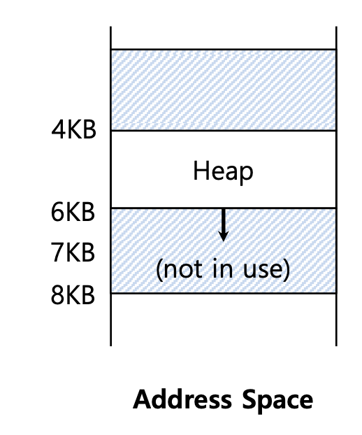

# Segment
내용을 들어가기 이전에 우리가 이전 챕터에서 공부했던 base bound 방식을 생각해보자.
cpu의 레지스터에 있는 가상메모리의 주소가 실제로 물리메모리에 매핑되어져 있다. 프로세스에게 가상 메모리의 주소를 자신이 메모리를 독점하고 있다는 착각을 하게 하면서 실제 물리 메모리 주소를 찾아 가기 위해선 cpu 내의 장치인 MMU의 base와 bound를 사용하였다.

## 1. Inefficiency of the base and bound  approach
 
- 위의 그림은 운영체제가 메모리 가상화를 이용하여 각 프로세스마다 메모리를 독점 하고 있다고 착각하도록 만든 상태이다.
- 메모리엔 code, Heap, Stack 영역이 존재하고, heap은 증가 하는방향과, Stack은 감소한는 방향으로 늘어난다.
- 하지만 중간에는 free한 공간이 존재하고, 이것들은 역시 물리 메모리에서도 공간을 차지하는 문제가 생긴다.

## 2. segment
- 1번 같은 문제가 발생하기 때문에, 위의 그림 같이 물리메모리 공간에 넣는것이 아니라, code,stack,heap 부분을 따로 나눠서 물리 메모리에 배치하기로 한다. 이렇게 작은 단위로 나누어 진 것들을 segment라고 한다. 따라서 위와는 다르게 각 segment 들은 각각의 base와 bound를 갖는다.
 
## 3. Address Translation on Segmentation
- segment의 가상 주소를 구하는 식은 **Physical Address = offset + base** 이다.
 
- offset를 구하는 방법 : (현재 주소) - (segment의 시작 주소) = offset
- 위의 그림을 적용시켜 보면, 4200 - 4096(4KB) = 104 이다.
- 실제 Physical adress는 offset + base이므로 104 + 34K 이다.
- segment의 physical address를 구히가 위해선 virtual address를 사용하지 않는다.
## 4. Segmentation Fault
 
- heap의 bound보다 넘어 가면 segmentatino violation 또는 fault라고 한다.
- 위의 그림을 보면 heap의 영역은 6까지인데, 7까지 하려 한다면 문제가 생긴다.
## 5. Referring to Stack Segment
 
- segment의 종류를 구분해 주기 위해 위와 같이 2비트를 사용한다.
- 가상주소 4200을 예로 들어보면 아래와 같고, segment는 식별값으로, offset로 최대크기를 알 수 있다.
- 더 많은 segment을 식별하기 위해 2bit가 아니라 더 큰 bit를 사용할 수 있지만, 식별값으로 사용할 테이블이 커지는 문제가 생긴다.
 

 
- 위의 그림은 주소가 증가하는 방향을 표시하기 위한 것이다.
- heap 같은 경우 할당을 받을 때 0부터 시작한다면, 1,2,3 으로 증가하지만, stack 같은경우 10부터 시작한다면 10,9,8,7 감소한다. 주소의 방향을 표현해 주기 위해 양의 방향으로 할당된다면 1을, 음의 방향으로 할당된다면 0을 사용한다.

## 6. Support for sharing

 
- 동일한 프로그램을 동시에 2번 실행하게 되면, 메모리에 동일한 프로세스가 2개 배치된다. 하지만 두개의 프로세스는 동일한 코드를 갖고 있고 두 프로세스에서 모두 메모리에 배치되어있다.
- 위와 같은 경우에 두개의 코드를 메모리에 배치하지 않고, 한개의 프로세스에만 코드를 올리고 또 다른 프로세스는 앞의 프로세스 코드를 할 수 있다.


## 7. Memory Compaction
 
- 왼쪽의 그림은, 메모리 공간을 적은 빈공간을 두고 프로세스가 배치되어져 있는 상황이다.
- 빈 메모리 공간의 크기 중 가장 큰것이 8KB이다. 만약에 10KB를 배치해야 한다면 어떻게 해야할까 ?
- 오른쪽과 같이 사용하는 공간을 몰아놓고, 빈 메모리 공간을 합쳐 놓는 방식을 사용한다.
- 하지만 이 방법은 segment의 base를 변경하고, 복사하고 하는데는 너무 비용이 많이 들기 때문에 최소화 하려고 한다.

# Free-Space Management
위와 같이 메모리에 빈 공간을 관리하는 방법을 다루는 챕터이다.

## Splitting
Heap에서 요청된 크기만한 빈 메모리공간을 찾아 나누는 방법을 알아본다.
free list 는 운영체제가 메모리의 빈 공간을 관리하기 위해 사용하는 방식이다.
밑의 것을 공부하기에 앞서, 한가지 알아둘게 있다.
 
밑의 그림은 헤더를 구조체로 구현한 것과, ptr와 ptr의 헤더부분을 나타낸다.
 
 밑의 코드는 free를 할때이다.  

 ```c
  void free(void *ptr) {
         header_t *hptr = (void *)ptr – sizeof(header_t);
}
 ```
  
우리는 malloc 함수를 사용하면, 메모리에 요청한 메모리 공간을 확보한 후에, 첫 주소를 값으로 준다. 하지만, 삭제할때는 아무 값도 넣지 않는다. 그 이유는 삭제할때도 설정을 해야 한다면, 개발이 굉장히 복잡해 질것이다. 그렇기 때문에 나중에 입력값 없이 삭제하기 위해서 malloc으로 생성될때, 할당받은 메모리 크기 외에 헤더 부분이 존재하고, 그곳엔 magic code와, 메모리의 크기에 대한 정보가 담겨져 있다.

- 빈 메모리 공간은 free list에 linked list 자료구조를 사용해서 관리를 한다.
- 위의 그림에서 약 1byte를 다시 할당 받아 보자.
 
- 1바이트가 사용되어져, 이전에 있던 메모리 빈공간이 줄어든것을 확인할 수 있다.

## Coalescing   
 
 - 위의 그림과 같이 freelist에는 빈 메모리 공간이 3개의 청크로 나누어져 있지만, 사실 메모리 주소만 보면 모두 이어져 있다. 그래서 3개의 청크를 한개의 큰 청크로 만드는 것을 coalescing이라고 한다.  
## A Heap With One Free Chunk  
 
- 위의 그림은 한개의 빈 메모리공간을 가진 heap이다.
- 메모리 할당을 요청하면, 먼저 충분한 크기의 빈 메모리 청크를 찾고, 두개로 나눈 뒤에 빈 메모리 청크는 밑으로 내려간다.
 
- 위의 그림은 100byte를 요청하는 그림이다.
- 왼쪽의 한개의 청크가, 오른쪽으로 두개의 청크로 나뉘어 진다.
- 위의 청크는 할당된 것을 의미하고, 밑의 것은 빈 청크를 의미한다.
- 각 청크마다, 헤더가 존재한다.
 
 - 위의 그림은 다시 free를 하는 모습이다.
 - 2번째 부분이 free를 하여 빈공간이 되었고, next를 다음의 긴 빈메모리 공간의 시작점을 가리키는 것을 볼 수 있다.
 - free list를 나타내 보면 100 -> 3764 이다.
  
 - 위의 그림은 할당받았던 모든 메모리를 free로 반환하는 모습이다.
 - free list로 나타내 보면, 100 -> 100 -> 100 -> 3764 이다.
   
## Growing The Heap
- heap 공간을 계속 할당 받을때, 공간이 부족하면 break가 되고, err 나거나 heap의 사이즈를 늘려준다고 했었다.
- 이곳에선 힙이 어떻게 늘어나는지 설명한다.
 
- **break**는 경계이다.

## Managing Free Space : Basic Strategies
- 빈 메모리 공간을 찾는 전략이다.
- First fit : 앞에서 부터, 요청에 충분히 큰 빈 메모리 청크를 찾는다.
- next fit : 처음부터 다시 시작하지 않고, 이전에 찾았던 위치에서 충분히 큰 메모리를 찾는다.
   
- 하지만 위의 방법을 쓰더라도, 불편한건 변하지 않는다.
- 그렇기 때문에 빈번히 요청되는 크기의 풀을 미리 만들어 놓는 방법도 사용한다. 그것을 **Segregated List**라고 한다.

## Buddy Allocation  
   
- 메모리의 빈공간을 요청에 알맞은 크기가 될때까지 2등분을 해서 사용한다.
- 하지만 위와같이 10KB를 요청할 때, 16KB를 할당받는다. 6KB는 필요가 없는 부분이고, 받는 입장에서도 알지 못한다.
- 하지만 위와 같이 사용하면 빈 메모리 공간이 옆에 붙어 있으므로, coalescing이 효율적이고 쉽다.
