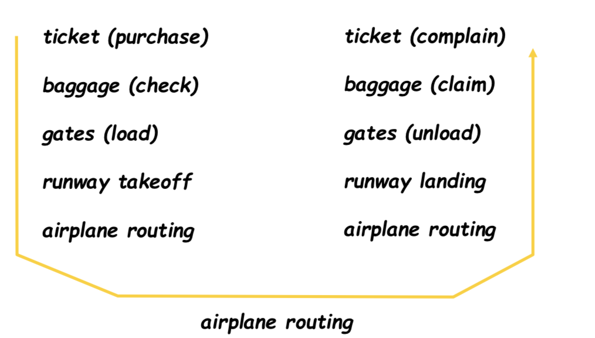
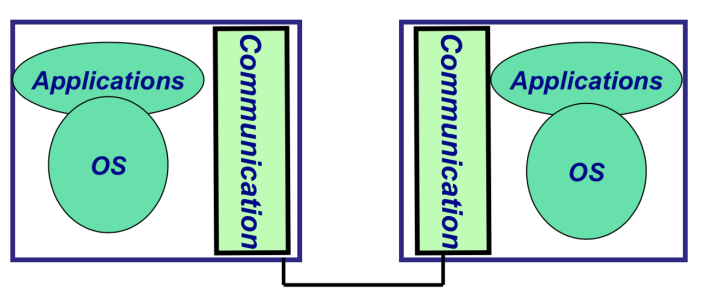
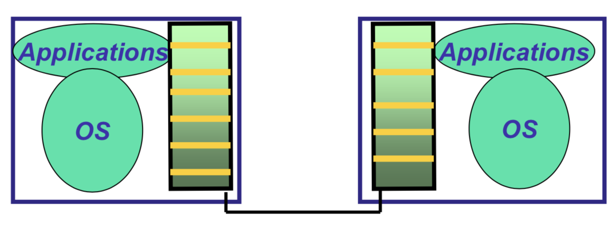
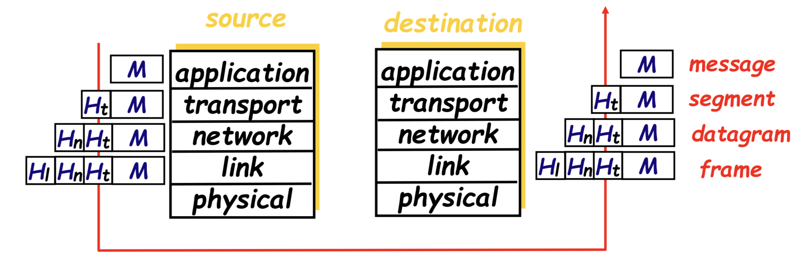
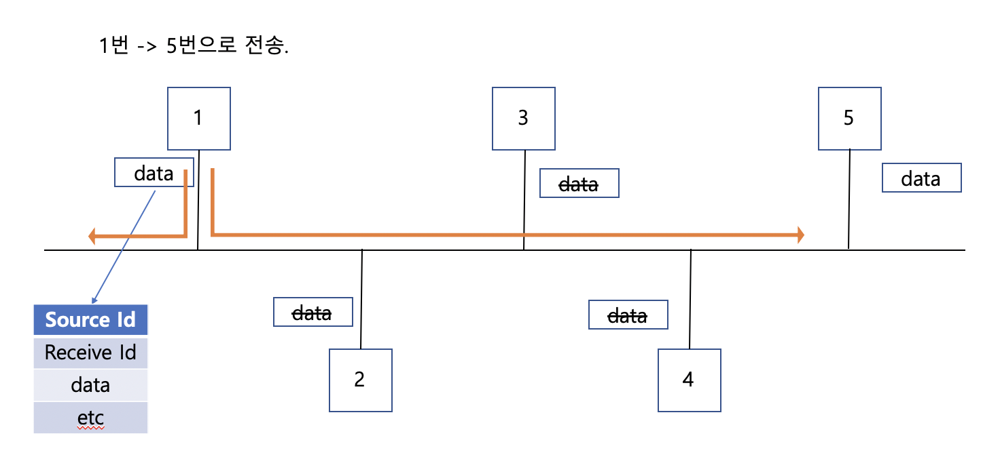
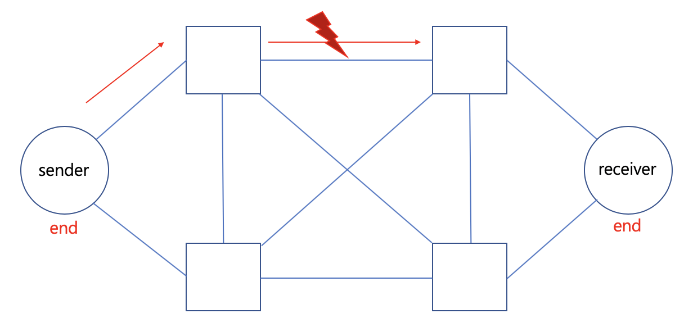

# Network Models
Protocol : 네트워크에서 통신을 할때 따라야할 규칙.

룰이 많아져서 복잡해 지기 때문에 나누는 것이 Protocol Layering이다.

프로토콜은 크게 2가지 종류가 있다.
1. 서로 다른 레이어 사이에서의 규약
2. sender와 receiver 사이에서의 규약

## sender와 receiver가 통신을 위해 사용하는 protocol layer는 비행기를 이용하기 위해 진행하는 절차들과 유사하다.
> 
> ## 비행기로 목적지 까지 가기 위한 진행
> 1. 티켓 구매
> 2. 화물 젒수
> 3. 게이트 찾기
> 4. 이륙
> 5. 비행 루트를 찾아 목적지를 찾아가기.

## 출발 했다면, 도착하는 진행 사항도 보자.
>1. 비행 루트를 찾아 목적지 찾아가기
>2. 착륙
>3. 게이트를 통해 공항으로 진입
>4. 화물 찾기
>5. 이미그레이션

### **위의 비행기를 이용하는 순서는 우리가 데이터를 네트워크로 보내는 컨셉과 동일하다.**

## **그럼 비행기 타는데 저렇게 여러개의 프로세스로 나눈 이유가 무엇일까?**
> **한개의 싱글레이어보다 multi layer implementation 를 이용하는것이 정확하다.**    

> 비행기는 하늘에서 이동하기 때문에, 안전한 운행을 위해 엄격한 규제를 따라야 한다.  
예를 들어 무기소지 , 마약소지, 폭탄소지 , 건강상태, 불법 입국 여부 등을 모두 확인한 후에, 비행기는 이륙을 진행 해야한다.  
그러기 위해선 한 섹션에서 모두 처리하는것 보단, 여러 섹션으로 나누어 전문적으로 정확하게 일을 처리하는것이 효율적이고 안전하기 때문이다.  
이것은 한대의 자동차를 만들기 위해 분업화 해서 하는것과 동일하다고 생각하면 된다!
 
>single layer implementation
> 

>multi layer implementation
> 

>그림과 같이 커뮤니케이션을 한단계로 하는것 보다 , 여러 단계를 나눠 하는것이 더 정확하다.

## **TIP/IP 모델(5 layer model)**
>1. application  :
> - 종류   
>       - http(hyper text transper protocol)  
>       - smtp(simple message transper protocol) : 보낼때  
>       - pop(받을때)  
>       - ftp  
>       - CoAP  
>       - MQTT    
> - 특징 :  이런것 들은 사람들에 익숙한 protocol 이다.  
>2. transport : TCP,UDP  
> - 특징 : end to end  
>3. network : IP  router(길찾아가는것)  
>4. data link : ethernet ()  
>5. physical  

> 밑의 그림과 같이 각각의 세그먼트에는 상대방의 counter part에서 사용할 header를 붙혀주는 모습이다.  
> 또 목적지 까지 잘 도착했다면, 해당하는 layer에서 헤더를 하나씩 제거하여 사용자에게 전달한다.  
> 

## protocol stack
>계층화 구조로 모여있는 프로토콜들의 집합.  
>밑과 같이 각 layer의 규약들이 하나씩 쌓이는 것을 protocol stack이라 한다.
> 1. http : http -> tcp -> ip -> ethernet 
> 2. streaming : Streaming -> udp -> IP -> ethernet

  
## suite 
> 서비스를 만들기 위해 위와 같이 갖춰진 프로토콜의 집합.  
>ex : 드레스 코드에 반드시 맞춰줘야 할 것들.

## **suite와 protocol stack의 차이를 구분해야함! 시험**

그래서 Transport 와 network 부분을 TIP/IP 라고 한다. IETF 에서 만듬.
data link 와 physical 부분을 ethernet 이라고 한다. IEEE 802.11x에서 만들었다.

## **다음으로 네트워크에서 data가 전송되는 과정을 살펴보자.**
> 
> 그림을 보면, 1번 노드는 5번 노드로 데이터를 전기 신호로 바꾸어 전송하는 모습을 보여주고 있다.  

> 그리고 보내는 데이터에는 목적지의 주소와, 보내는 데이터 등이 존재한다.  

> 1번이 데이터를 link를 이용하여 전송하게 되면, link에 연결된 모든 노드들이 해당 데이터를 받는다.  

> 하지만, 각 노드들은 목적지가 자신이 아니라면 버리는 방식을 사용한다.  

> 여기서 중요하게 알아둬야 할 것이 있다.  
> 1번이 5번으로 signal을 보내는 시점에, 다른 노드가 신호를 동시에 보낸다면, conflict 에러가 난다.  
> **그렇기 때문에 링크에 동시에 신호를 주면 안된다.**

## 그럼 어떻게 동시에 신호를 주지 않고, 많은 노드들이 통신을 할 수 있을까?
> 약 3가지의 방법이 존재한다.
> 1. control-base : 감독관(watch dog)이 존재하여 한명씩만 신호를 보낼 수 있도록 제어한다. 
>   - polling : 감독관이 각 노드마다 보낼 데이터가 있는지 물어봐서 허가 해주는 방식  
> 2. aloha : 에러가 나도 그냥 받을 때 까지 무작정 보내는 방식  
>   - 계속 겹쳐버릴 수 있기 때문에 컴퓨터 마다 random delay를 주어 텀을 주고 보낸다.  
>   - 무식해 보이지만 가장 많이 사용하는 방법이고 효율적인 방법이다.  
>   - 이렇게 하지 않고, 다 물어보게 된다면, 알로하 방법보다 이전에 해야할 cost가 더 들게된다.  
> 3. csma : link에 센서로 누가 보내고 있는지 확인하다가 없으면 보내는 방식.  
>   - CSMA-CD : 충돌하면 그떄 해결하는 방식 , wire 네트워크에서 사용  
>   - CSMA-CA : 충돌을 피하도록 하는 방식 , wireless 네트워크에서 사용  

## 하지만, 도중에 어떠한 장애요인으로 인해서 데이터를 요청받지 못하면 어떻게 될까?

> 

> 이 그림은 sender가 receiver로 데이터를 전송하는 도중에 번개 표시에서 문제가 생겨 데이터를 잘못 받거나 받지 못한 상황이다.

> **이전에 언급했던, 무사히 도착했는지 확인 하는 방법에 대해서 간단하게 이야기하고 넘어가자.**
> - 약 3가지 방법이 존재한다.  
>       - parity bit
>       - CRC
>       - checkSum

> 위의 방식으로 receiver 노드는 자신이 데이터를 sender로 부터 잘 받았다는 메시지를 전송한다.(ack)
> 하지만, 받지 못하거나, 손상된 정보를 받았을땐 Retransmission을 요청한다.  
> 하지만 receiver가 계속해서 받지 못했다고 한다면, sender약 4번의 재전송 후에, best effort란 에러를 전송하고, 연결을 포기한다.

>Sender는 데이터를 전송한 이후에 정해진 시간안에 응답 신호가 오는것을 확인한다. 그것을 WDT(Watch Dog Timer) 방식이라고 한다.    

> 위의 방식으로 timeout이 된다면 nack를 전송한다.

> 위에서 말한 재전송 방식은 hop이 일어날때의 상황이다. 

> 이러한 재전송 방식은 transport 계층의 TCP 프로토콜에서 동일하게 일어난다.  
> **차이점**으로는 위의 방식은 서로를 이어주는 *router와의 관계*에서 실행되지만, *TCP* 는 *sender와 receiver의 관계*로 실행된다.
> - UDP는 TCP와 다르게 전송을 잘 받았는지 확인하지 않고, 보내기만 하는 방식이다. 그래서 실시간으로 해야하는 Streaming이나 voip에서 사용된다.