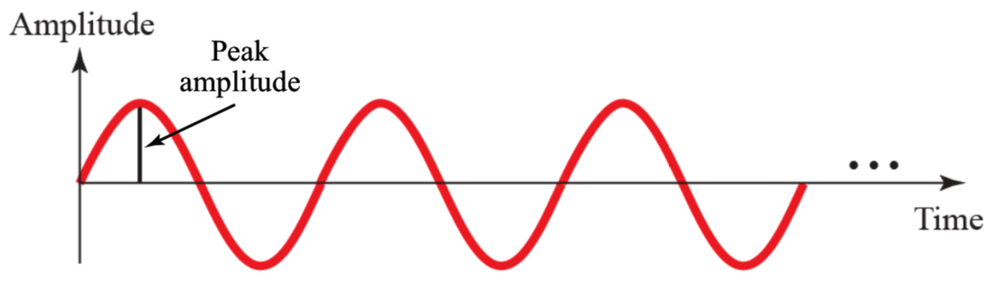
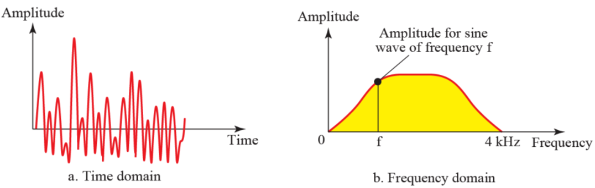

# Phisical Layer

## 1. 물리 계층이란
물리적인 communication을 위한 protocol이 존재한다.  
그러므로 data link 계층으로 부터 온 데이터를 물리 계층에서 전환된다.  

## 2. Analog and digital signal
- 1.Data
    - 1. analog data : 연속적인 성격을 가진 데이터
        - ex) 아날로그 시계, 사람의 목소리
    - 2. digital data : 0과 1로 연속되지 않은 데이터
        - ex) 디지털 시계
- 2.Signal
    - 1. analog
        - 무한의 값이 많은 value를 갖는다.
         
    - 2. digital
        - 제한된 value값을 갖는다.
        - 0과 1로 표현된다.
         

## 3. Periodic and Nonperiodic
- 1. Periodic signal(주기적)
    - 특정 시간(period) 동안 패턴을 만든다.
    - simple periodic analog signal 
        - sine wave 
    - Composite periodic analog signal
        - 복수의 sine wave로 구성된다.
- 2. sine wave
  
    일정 기간동안 특정 패턴을 갖는다.
    

    - Peak Amplitude
    
        - peak amplitude 높으면 목소리도 높다.
    
    -  sine wave의 특징
        - Period(T) : 1 cycle이 완료되는 시간.
        - Frequency(f) : 1 초 동안  period의 수.
        - f = 1 / T
        - T = 1 / F 로 표현 가능하다.
        - 비교 
        
            - 1초에 12의 period가 존재하므로 
            - period : 1/12 s, 12Hz이다.
            - peroid가 많아지면 high frequency이고, period가 작아진다.
        
            - 1초에 6개의 peroid가 존재하므로
            - peroid : 1/6 s, 6Hz이다.
            
        - Phase
        wave form이 시작할때의 position을 의미한다.
         

    sine wave를 정의하는 것은 amplitude, frequency, phase로 총 3가지 이다.  
    표현 하는 방식으로는 ```time domain plot```과 ```frequency domain plot```이 존재한다.

    1. time domain plot
    
        - time을 x축으로 하기 때문에 보기 편하다.
        - 하지만 복잡해지면 알아보기 힘들다.
    2. frequency domain plot
    
        - 익숙하지 않아 불편하지만, 위의 것을 간단하게 나타낸다.
    3. 위의 예를 보자.
    
    - 첫번째 그림은 한번에 3개의 sinewave를 나타내기 때문에 굉장히 복잡한 반면
    
    - 두번째 그림으로 frequency 기준으로 그리면 간단해진다.

- 3. Composite Signals
    많은 simple sine wave들로 인해 구성된다.
    - Fourier analysis : 어떤 composite signal은 다른 frequency,amplitude, phase를 가진 sine wave의 조합이다.
    - composite signal 또한 periodic 과 non-periodic이 존재한다.
    - 예제1 : Periodic  

    
        - 위의 그림은 복잡하지만 연속된 신호(**periodic somposite signal**)이다.  
        - 여러 simple sinewave가 합쳐진 것이다.

    
        - 첫번째 그림의 것을 여러개의 simple sine wave로 표현한 것이다.

          
    - 예제2 : non-periodic  

    
    - 위의 그림은 **nonperiodic somposite signal**이다.
    - 오른쪽의 그림은 f 밑의 신호들은 너무 작기 때문에 잘라버리고 사용하지 않는다.

    amplitude
- 3. Nonperiodic signal(비주기적)
    - 패턴 없이 바뀐다. 
    


## 4.Bandwidth
복잡한 신호(composite signal)안에 주파수의 범위를 bandwidth라고 한다.  BPS(Bit Per Second)로 표현한다.
Badnwidth =  (가장 높은 주파수) - (가장 낮은 주파수)  
Bandwidth가 높을 수록, 많은 데이터를 보낼 수 있고 빠르다.
참고
- AM 라디오 주파수범위는 530 ~ 1700kHz이다.
- FM 라디오 주파수 범위는 88 ~ 108 MHz이다.
- 그러므로 FM 라디오에서 데이터를 많이 보낼 수 있다.

    
## 5.Digital Signals
컴퓨터는 바이너리 연산을 하기 때문에, 디지털 신호(0,1)로 사용해야한다.
- 1. 디지털 신호가 L Level을 같는다면, Log2L이 필요하다.

- 위의 그림은 1개의 비트를 사용하여 2개의 level이 존재한다.

- 위의 그림은 2개의 비트를 사용하여 4개의 Level이 존재한다.
- 1비트보다 더 많이 데이터를 보낼 수 있으므로 전송속도가 빨라진다.
- 예제
    - 1.9 레벨의 디지털 신호가 있다면, 몇개의 비트가 필요한가 ?
        - Log2의 9를 계산해 보면, 3.17 bit이다. 그러므로 최소 4비트가 필요하다.
### Bit Rate
Bit Per Second(BPS)를 의미한다. 1초에 몇 bit를 보낼 수 있는지
- 1. 예제
    - 한 페이지에 24줄이 들어가고, 한 줄엔 80개의 character가 들어간다. 총 100페이지를 1초에 보내기 위해서 얼만큼의 bitrate가 필요한가
        - 100(page)* 24(lines) * 80(char) * 8(bits per char) = 1,536,000 bps = 1.536 Mbps
    - HDTV(1920 x 1080 pixels)rk 1초에 30번 스크린을 바꾼다면, 얼만큼의 bit rate가 필요한가? (한 픽셀의 색을 나타내기 위해 24 bits 사용)
        - 1920 x 1080 x 30(screens) x 24(bits per one pixel) = 1,492,992,000 = 1.5Gbps

### Bit Length
wavelength란 한 사이클이 transmission medium을 점유하는 길이 이다. 주기라고도 하며, 한 cycle 의 길이이다. 
**bit length**란 한 bit가 transmission medium을 점유하는 길이 이다.

- 1.현실 세계의 데이터 통신에서  비주기적 디지털 신호가 발생하다고 생각해보자.
    - 디지털 신호를 다른 목적지 까지 전달하는 방법은 2가지가 있다.
        - ***Baseband transmission***
        - **Broadband transmission***
    - 밑에 넘어가기에 앞서, 모든 통신의 기본은 **아날로그**라는 것을 알아두자
- 2.Baseband transmission

    - 디지털 신호를 아날로그로 변환하지 않는다.
    - low-pass channel이 필요하다.
        - bandwidth가 0부터 시작하는 채널이다.(이런 경우 절대 없다.)
        - low-pass channel은 ***wide bandwidth*** 와 ***limited(narrow) bandwidth*** 가 존재한다.

    - Low-pass channel, wide bandwidth
            
             0부터 시작, 넓은 대역을 사용한다.
            
            이 곳에선 low-pass channel이 무한대의 badnwidth를 가진다고 가정해보자.(불가능함.)
            위의 그림을 보면 목적지에 도착한 신호는 왜곡으로 인해 손상된다.
            그러므로 분석을 해서 유추를 해내어 아날로그 신호로 변환한다.  
       
    - Low-pass channel narrow bandwidth
            
             0부터 시작, 한정된 대역을 사용  
             wide는 실제로 굉장히 비용이 많이 들기 때문에 불가능하다.  
             대략젹으로 유추하는 방법으로는 **Rough Approximation** 과 **Better Approximation** 방법이 있다.  
        - Rough Approximation
        ```도저히 이해를 못하겠음 물어봐야됨.```
        - Better Approximation
        주파수에 harmonics를 더해 bandwidth를 증가 시킨다.(N/2,3N/2,5N/2)
        
        
            - bits를 빨리 보내기 위해선 더 넓은 bandwidth가 필요하다.
    
- 3.Broadband transmission(modulation)

    - 디지털 신호를 아날로그 신호로 변환한다.
    - band-pass channel을 사용한다.
        - bandwidth가 0부터 시작하지 않는다.(이게 현실세계의 특징.)

    
    - in band-pass channel
        - 1.디지털 신호를 composite아날로그 신호로 변환.
        - 2.single-frequency analog signal 이용
        - 3.carrier의 amplitude가 디지털 신호 처럼 보이게 변환됨.
        - 4.리시버는 받으면 디지털 신호로 변환
        - 5.결과는 원본의 복제와 같다.

## 6. Transmission Impairment
신호들은 link를 통해 이동하면서 손상되고, link의 불완전성이 impairment를 만든다. 원인으로 3가지가 존재한다.
- attenuation  
에너지의 손실을 의미한다. 신호의 전기에너지는 저항으로 인해 열이 발생한다. 그렇기 때문에 신호는 약해지고, 중간에서 amplifiers를 사용하여 신호를 증폭시킨다.

- distortion
- noise

        
    


  

    

