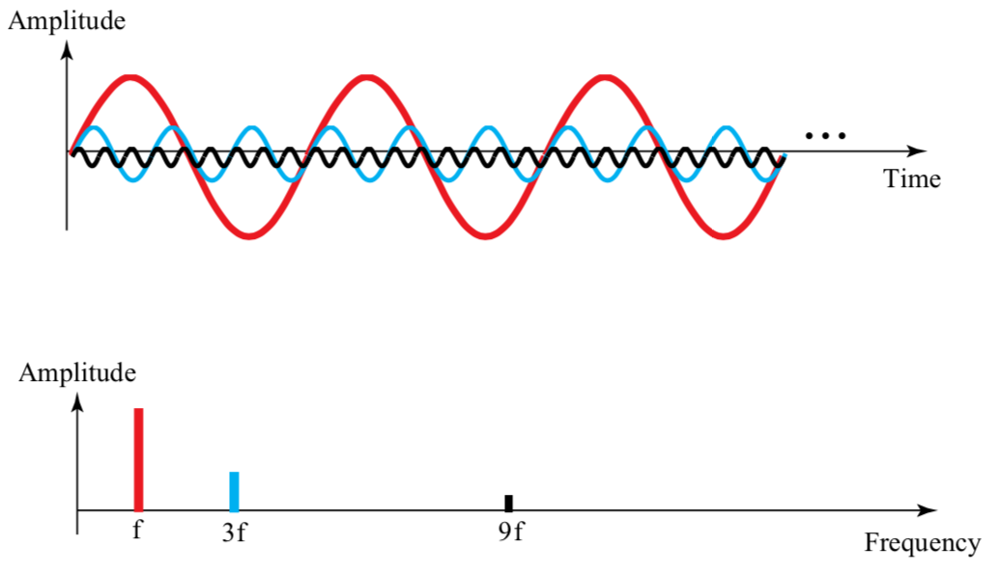

# Phisical Layer

## 1. 물리 계층이란
물리적인 communication을 위한 protocol이 존재한다.  
그러므로 data link 계층으로 부터 온 데이터를 물리 계층에서 전환된다.  

## 2. Analog and digital signal
- 1.Data
    - 1. analog data : 연속적인 성격을 가진 데이터
        - ex) 아날로그 시계, 사람의 목소리
    - 2. digital data : 0과 1로 연속되지 않은 데이터
        - ex) 디지털 시계
- 2.Signal
    - 1. analog
        - 무한의 값이 많은 value를 갖는다.
         
    - 2. digital
        - 제한된 value값을 갖는다.
        - 0과 1로 표현된다.
         

## 3. Periodic and Nonperiodic
- 1. Periodic signal(주기적)
    - 특정 시간(period) 동안 패턴을 만든다.
    - simple periodic analog signal 
        - sine wave 
    - Composite periodic analog signal
        - 복수의 sine wave로 구성된다.
- 2. sine wave
  
    일정 기간동안 특정 패턴을 갖는다.
    

    - Peak Amplitude
    
        - peak amplitude 높으면 목소리도 높다.
    
    -  sine wave의 특징
        - Period(T) : 1 cycle이 완료되는 시간.
        - Frequency(f) : 1 초 동안  period의 수.
        - f = 1 / T
        - T = 1 / F 로 표현 가능하다.
        - 비교 
        
            - 1초에 12의 period가 존재하므로 
            - period : 1/12 s, 12Hz이다.
            - peroid가 많아지면 high frequency이고, period가 작아진다.
        
            - 1초에 6개의 peroid가 존재하므로
            - peroid : 1/6 s, 6Hz이다.
            
        - Phase
        wave form이 시작할때의 position을 의미한다.
         

    sine wave를 정의하는 것은 amplitude, frequency, phase로 총 3가지 이다.  
    표현 하는 방식으로는 ```time domain plot```과 ```frequency domain plot```이 존재한다.

    1. time domain plot
    
        - time을 x축으로 하기 때문에 보기 편하다.
        - 하지만 복잡해지면 알아보기 힘들다.
    2. frequency domain plot
    
        - 익숙하지 않아 불편하지만, 위의 것을 간단하게 나타낸다.
    3. 위의 예를 보자.
    
    - 첫번째 그림은 한번에 3개의 sinewave를 나타내기 때문에 굉장히 복잡한 반면
    
    - 두번째 그림으로 frequency 기준으로 그리면 간단해진다.

- 3. Composite Signals
    많은 simple sine wave들로 인해 구성된다.
    - Fourier analysis : 어떤 composite signal은 다른 frequency,amplitude, phase를 가진 sine wave의 조합이다.
    - composite signal 또한 periodic 과 non-periodic이 존재한다.
    - 예제1 : Periodic  

    
        - 위의 그림은 복잡하지만 연속된 신호(**periodic somposite signal**)이다.  
        - 여러 simple sinewave가 합쳐진 것이다.

    
        - 첫번째 그림의 것을 여러개의 simple sine wave로 표현한 것이다.

          
    - 예제2 : non-periodic  

    
    - 위의 그림은 **nonperiodic somposite signal**이다.
    - 오른쪽의 그림은 f 밑의 신호들은 너무 작기 때문에 잘라버리고 사용하지 않는다.

    amplitude
- 3. Nonperiodic signal(비주기적)
    - 패턴 없이 바뀐다. 
    