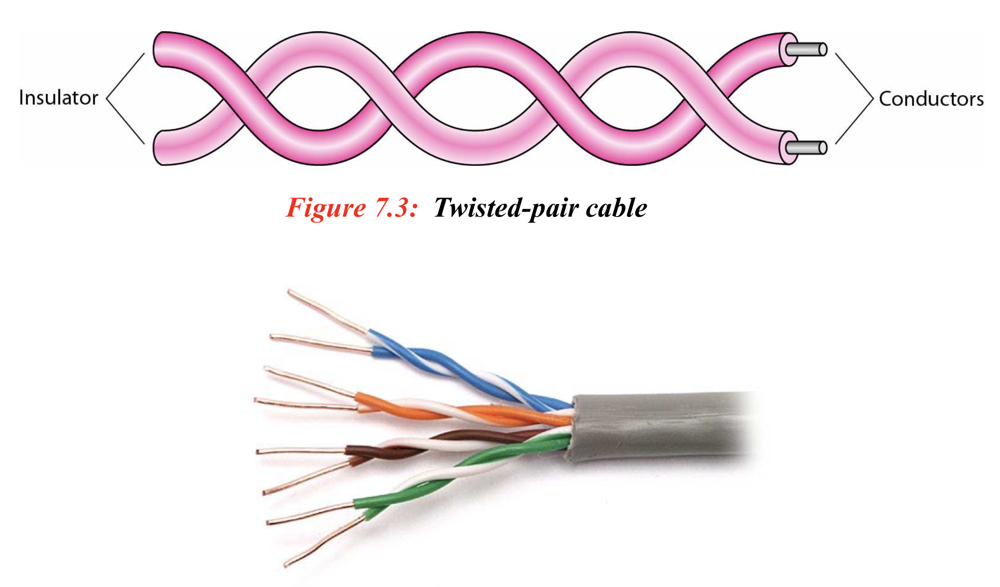
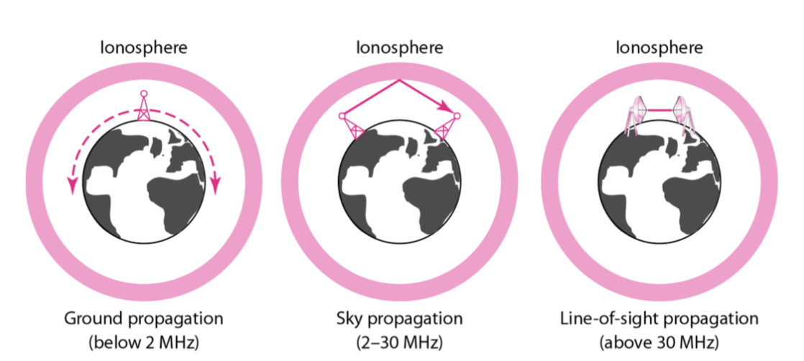

# Transmission Media
## 1. 설명 
> 
> ### 1.사전적 의미 
> - 매질(媒質)은 어떤 파동 또는 물리적 작용을 한 곳에서 다른 곳으로 옮겨 주는 매개물이다. 예를 들어, 소리의 매질은 일반적으로 공기(기체)이지만, 액체 또는 고체도 포함한다.
> ### 2.설명 : 데이터를 전기적 신호로 변경하여 전송하는데(physical layer), 전송 해줄 매체를 이야기한다. 위의 그림과 같이 **Guided media(유선)** 과 **Unguided media** 로 나뉘어 진다.

## 잠깐 밑의 내용을 이해하기 위해 필요한 기초 이론들을 이야기 해보려고 한다.
> 
frequency(진동수) : 1초동안 cycle(진동)의 수를 의미하고,
Hz 단위를 사용 한다.

횡파(primary wave) : 일직선상으로 온다.  
 ex)지렁이의 움직임
종파(secondary wave) : 포물선을 그리면서 온다.  
ex) 뱀의 움직임

>Electromagnetic Spectrum - (wireless)
> 
> 위의 그림과 같이 이 세상에선 위와 같은 주파수의 대역이 존재한다.
> 주파수가 낮을 수록 진동수가 적고, cycle의 길이가 길다. 하지만, 횡파이기 때문에 장애물이 있어도, 반사가 되어 멀리 갈 수 있다는 장점이 있다.   
>주파수가 높을 수록 진동수가 많고, cycle의 길이가 짧다. 종파이기 때문에 장애물이 있으면 문제가 되고, 진동수가 높기 때문에 깊은 빠르다.

## 2.Guided Media
> ### 1. 설명 : 유선 매체에 해당하며, 전기가 통하는 **copper(구리)** 를 사용한 **twisted-pair cable**과 **coaxial cable**이 존재한다. 또 빛의 형태를 신호로한 **fiber-optic cable**이 존재한다.

> ### 2. Twisted-pair cable
> 
>> 1.특징 : 두개의 구리 선으로 꼬아져 있다.  
>> 2.한개의 전선이 전기를 통과하게 되면 전선 주위로 자기장이 발생한다. 이런 문제는 신호가 손상되는 원인이 된다. 그렇기 때문에, 이와 같이 두개의 선을 꼬아 문제를 해결하였고, 더 나아가 metal shield를 두어 자기장으로 부터 신호를 보호하는 방법을 사용한다.
>> 밑의 그림은 UnShield와, Shilded된 twisted-pair cable이다.
>> 
>> 3. 성능
>> 
>> 주파수에 대한 감쇄를 나타내는 그래프이다. 파란 선은 임계점으로, 그 이상은 신호의 감쇄가 심해 사용하지 못한다는것을 의미한다.
> ### 3. Coaxial cable
> 
>>1. 이전에 TV에 사용 되었던 선이다.
>>2. 중앙에 굵은 구리선이 있는것이 특징이다.
> ### 4. Fiber-optic cable
> 
>>1. 유리와 플라스틱 소재의 선으로, 빛 형태의 신호를 사용한다. 위의 두가지 선보다 빠르고, 내구성이 강하다.
>>2. 1600 Gbps, 랜에서, 100Base-FX를 사용. 위의 twisted pair cable이 사용하는 tx와 비교된다.
>>3. 장점으로, 높은 주파수대역을 사용하고, 강건하고, 가볍고, 도청이 불가능하다. 단점으론 가격이 비싸다.
>>4. 만들어진 원리.
## 3.UnGuided Media
> ### 1. 설명 : 무선 매체에 해당하며, waves를 전송 매체로 사용한다.
> 
>>1. ground propagation
>> - 낮은 주파수 대역을 사용하고, 모든 방향으로 전송가능하다.
>> - 사용 안테나는 Omnidirectional Antenna를 사용하고 멀티캐스트에 사용한다.(티비 라디오)
>>2. sky propagation
>> - radia wave보다 높은 주파수를 이용하여, 하늘에 있는 ionosphere의 반사를 이용해서 신호를 보낸다.
>> - 사용 한테나로는 Omnidirectional antenna이다.
> 
>>3. Line-of-sight propagation
>> - 높은 주파수 대역을 사용하므로, 직접적으로 서로 마주보고 신호를 전달 받아야한다.
>> - 사용 안테나로 parabolic dish antenna를 이고, 멀리 보낼 수 있지만, 1:1 이란 단점이 있다.
> 

## 4.Infrared
> 1.특징 
>> 1. 300GHz ~ 400THz를 사용한다.
>> 2. 주파수대가 높고, 벽을 통과하지 못한다.
>> 3. 리모콘에서 사용한다.